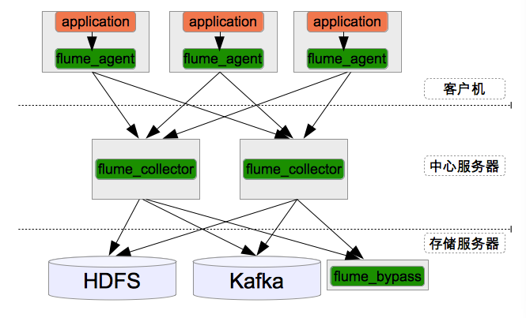
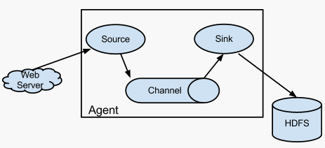
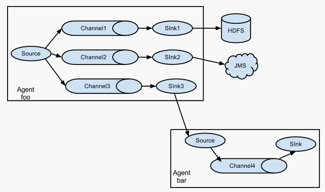
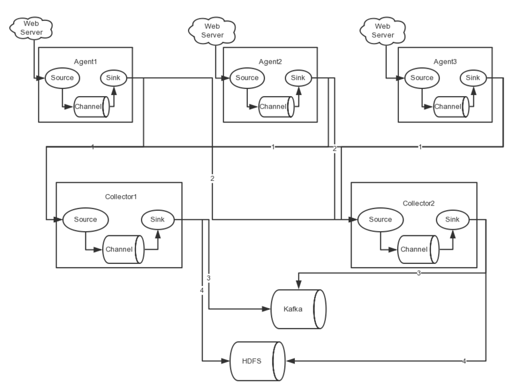

# Flume Quick Start

## 一、开始
[官网]( https://flume.apache.org/)
[User Guide](https://flume.apache.org/FlumeUserGuide.html#)
1. Flume是Cloudera提供的一个高可用的，高可靠的，分布式的海量日志采集、聚合和传输的系统。
2. Flume支持在日志系统中定制各类数据发送方，用于收集数据；同时，对数据进行简单处理，并写到各种数据接受方。
3. Flume有两个版本   
- Flume 0.9X版本的统称Flume-og  
  多Master，为了保证配置数据的一致性，引入了ZooKeeper保存配置数据，ZooKeeper本身可保证配置数据的一致性和高可用，另外，在配置数据发生变化时，ZooKeeper可以通知Flume Master节点。Flume Master间使用gossip协议同步数据

- Flume1.X版本的统称Flume-ng  
  取消了集中管理配置的 Master 和 Zookeeper，变为一个纯粹的传输工具。读入数据和写出数据现在由不同的工作线程处理（称为 Runner）。 在 Flume-og 中，读入线程同样做写出工作（除了故障重试）。如果写出慢的话（不是完全失败），它将阻塞 Flume 接收数据的能力。这种异步的设计使读入线程可以顺畅的工作而无需关注下游的任何问题

## 二、安装配置
### 1、get 压缩包
```
wget http://mirrors.sonic.net/apache/flume/1.7.0/apache-flume-1.7.0-bin.tar.gz
```

### 2、压缩文件解压
```
tar -zxf apache-flume-*-bin.tar.gz -C /usr/local/opt/flume/
```

### 3、配置flume环境
```
vim /etc/profile 或者 vim ~/.bash_profile[MAC]

## flume configuration
export FLUME_HOME=/usr/local/opt/flume/apache-flume-1.7.0-bin
export PATH=.:$PATH::$FLUME_HOME/bin

source /etc/profile 或者 source ~/.bash_profile[MAC]

# 添加Java 环境变量
cp -f $FLUME_HOME/conf/flume-env.sh.template $FLUME_HOME/conf/flume-env.sh
echo 'JAVA_HOME=/opt/jdk1.7.0_75/' >> $FLUME_HOME/conf/flume-env.sh
echo 'confgratulations! fluem has been installed and flume-env.sh has been set!'
```

### 4、 测试是否安装配置成功
```
flume-ng version
```
## 三、Flume设计图解
1. 系统结构图：  

系统可分为三层 —— Agent、Collector、Store ——收集log并存起来  
每个flume可分三层 —— Source、Channel、Sink —— 收集/传递/存储  

2. 结构图详解：  
- 单个  
  
- 多个  
  
- 复杂型  


### （三）Flume设计原理详解
每个flume分三层 —— Source、Channel、Sink —— 收集/传递/存储  
1. Source有几种
- Exec source  
实现：Unix command获得数据，最常用的就是tail -F [file]  
优点：简单，文件实时传输  
缺点：断点不能续传  
- Spooling Directory Source  
介绍：监控配置目录下新增的文件，并实时的将文件数据读出来  
优点：只要是在监控目录下的新文件都可以传输  
缺点：新文件不能再编辑、不能有子目录、只能做到近乎实时（如，一分钟一个文件）  

2. Channel有几种 
- MemoryChannel
可以实现高速的吞吐，但是无法保证数据的完整性
- JDBC Channel
- MemoryRecoverChannel
- FileChannel - 官方推荐
保证数据的完整性与一致性

3. Sink  
- 文件系统
- 集群文件系统
- 数据库

## 四、实践出新知
### 测试1 —— netcat_to_logger
```
vim flume-netcat-to-logger.conf

# Name the components on this agent
agent_1.sources = source_1
agent_1.channels = channel_1
agent_1.sinks = sink_1

# Describe/configure the source
agent_1.sources.source_1.type = netcat
agent_1.sources.source_1.bind = localhost
agent_1.sources.source_1.port = 44444

# Use a channel which buffers events in memory
agent_1.channels.channel_1.type = memory
agent_1.channels.channel_1.capacity = 1000
agent_1.channels.channel_1.transactionCapacity = 100

# Describe the sink
agent_1.sinks.sink_1.type = logger

# Bind the source and sink to the channel
agent_1.sources.source_1.channels = channel_1
agent_1.sinks.sink_1.channel = channel_1

启动
bin/flume-ng agent --conf conf --conf-file conf/flume-netcat-to-logger.conf --name agent_1 -Dflume.root.logger=INFO,console

开启输入
telnet localhost 44444
```

### 测试2 —— file_to_kafka
```
#编辑配置文件
vim conf/flume-file-to-kafka.conf

a1.sources = source_1
a1.sinks = sink_1
a1.channels = channel_1

a1.sources.source_1.type = exec
a1.sources.source_1.channels = channel_1
a1.sources.source_1.command = tail -F /tmp/flume/local/test.txt

a1.channels.channel_1.type = memory
a1.channels.channel_1.capacity = 1000
a1.channels.channel_1.transactionCapacity = 100

a1.sinks.sink_1.type = org.apache.flume.sink.kafka.KafkaSink
a1.sinks.sink_1.topic = test
a1.sinks.sink_1.brokerList = localhost:9092
a1.sinks.sink_1.requiredAcks = 1
a1.sinks.sink_1.batchSize = 20
a1.sinks.sink_1.serializer.class=kafka.serializer.StringEncoder

# Bind the source and sink to the channel
a1.sources.source_1.channels = channel_1
a1.sinks.sink_1.channel = channel_1

## 启动
bin/flume-ng agent --conf conf --conf-file conf/flume-file-to-kafka.conf -name a1 -Dflume.root.logger=INFO,console

## 测试脚本
for i in `seq 1 100`
do
    echo $i
done

sh -x tmp.sh >> /tmp/flume/local/test.txt

```

### 测试2 —— kafka_to_HDFS
```
## 编辑配置文件
vim conf/flume-kafka-to-hdfs.conf
 agent1.sources  = source_1
 agent1.channels = channel_1
 agent1.sinks = sink_1

 agent1.sources.source_1.type = org.apache.flume.source.kafka.KafkaSource
 agent1.sources.source_1.zookeeperConnect = localhost:2181
 agent1.sources.source_1.topic = test
 agent1.sources.source_1.groupId = flume-test
 agent1.sources.source_1.channels = channel_1
 agent1.sources.source_1.interceptors = i1
 agent1.sources.source_1.interceptors.i1.type = timestamp
 agent1.sources.source_1.kafka.consumer.timeout.ms = 100

 agent1.channels.channel_1.type = memory
 agent1.channels.channel_1.capacity = 10000
 agent1.channels.channel_1.transactionCapacity = 1000

 agent1.sinks.sink_1.type = hdfs
 agent1.sinks.sink_1.hdfs.path = /flume/kafka/%{topic}/%y-%m-%d
 agent1.sinks.sink_1.hdfs.rollInterval = 5
 agent1.sinks.sink_1.hdfs.rollSize = 0
 agent1.sinks.sink_1.hdfs.rollCount = 0
 agent1.sinks.sink_1.hdfs.fileType = DataStream
 agent1.sinks.sink_1.channel = channel_1
 
 ## 启动服务
 bin/flume-ng agent --conf conf --conf-file conf/flume-kafka-to-hdfs.conf -name agent1 -Dflume.root.logger=INFO,console
 
 ## 测试数据
 for i in `seq 1 100`
 do
    echo $i
 done
 
 sh -x tmp.sh | /usr/local/opt/kafka/bin/kafka-console-producer.sh --broker-list localhost:9092 --topic test
```

### 测试4 —— file_to_HDFS
```
vim flume-hdfs.conf
#define source monitor a file
agent1.sources.source_1.type = exec
agent1.sources.source_1.shell = /bin/bash -c
agent1.sources.source_1.command = tail -n +0 -F /tmp/flume/id.txt
agent1.sources.source_1.channels = channel_1
agent1.sources.source_1.threads = 5

# Define a memory channel called channel_1 on agent1
agent1.channels.channel_1.type = memory
agent1.channels.channel_1.capacity = 100000
agent1.channels.channel_1.transactionCapacity = 100000
agent1.channels.channel_1.keep-alive = 30

# Define a logger sink that simply logs all events it receives
# and connect it to the other end of the same channel.
agent1.sinks.sink_1.channel = channel_1
agent1.sinks.sink_1.type = hdfs
agent1.sinks.sink_1.hdfs.path = hdfs:///flume
agent1.sinks.sink_1.hdfs.writeFormat = Text
agent1.sinks.sink_1.hdfs.fileType = DataStream
agent1.sinks.sink_1.hdfs.rollInterval = 0
agent1.sinks.sink_1.hdfs.rollSize = 1000000
agent1.sinks.sink_1.hdfs.rollCount = 0
agent1.sinks.sink_1.hdfs.batchSize = 1000
agent1.sinks.sink_1.hdfs.txnEventMax = 1000
agent1.sinks.sink_1.hdfs.callTimeout = 60000
agent1.sinks.sink_1.hdfs.appendTimeout = 60000

# Finally, now that we've defined all of our components, tell
# agent1 which ones we want to activate.
agent1.channels = channel_1
agent1.sources = source_1
agent1.sinks = sink_1

启动
./flume-ng agent --conf ../conf/ -f ../conf/flume-hdfs.conf -n agent1 -Dflume.root.logger=INFO,console

【注】每一修改id.txt文件都会将全部的文件内容获取一次
```

###  测试5 —— kafka_to_kafka
```
agent.sources = s1
agent.channels =  c1
agent.sinks = k1

# singapore-cluster
agent.sources.s1.type = org.apache.flume.source.kafka.KafkaSource
agent.sources.s1.zookeeperConnect = 172.31.4.53:2181,172.31.4.54:2181,172.31.4.55:2181
#agent.sources.s1.zookeeperConnect = 10.10.20.14:2181,10.10.20.15:2181,10.10.20.16:2181
agent.sources.s1.topic =  report-zhizi
#agent.sources.s1.topic =  testtopic
agent.sources.s1.groupId = Jason-report-zhizi-2017022021
agent.sources.s1.kafka.consumer.timeout.ms = 10000
agent.sources.s1.batchSize = 20
agent.sources.s1.kafka.fetch.message.max.bytes = 2097152
agent.sources.s1.kafka.num.consumer.fetchers = 2
agent.sources.s1.kafka.auto.commit.enable= true
agent.sources.s1.kafka.auto.offset.reset = largest
agent.sources.s1.channels = c1

agent.sources.s1.interceptors = i1
agent.sources.s1.interceptors.i1.type = static
agent.sources.s1.interceptors.i1.key =  topic
agent.sources.s1.interceptors.i1.preserveExisting = false
agent.sources.s1.interceptors.i1.value = testtopic

# Channels
agent.channels.c1.type = memory
agent.channels.c1.keep-alive = 3
agent.channels.c1.capacity = 20000
agent.channels.c1.transactionCapacity = 2000
agent.channels.c1.byteCapacityBufferPercentage = 20
agent.channels.c1.byteCapacity  = 4000000000

agent.sinks.k1.type = org.apache.flume.sink.kafka.KafkaSink
agent.sinks.k1.topic = testtopic
agent.sinks.k1.brokerList =  10.10.20.14:9092,10.10.20.15:9092,10.10.20.16:9092
agent.sinks.k1.requiredAcks = 1
agent.sinks.k1.batchSize = 20
agent.sinks.k1.channel = c1
```

> @ 学必求其心得，业必贵其专精
> @ WHAT - HOW - WHY
> @ 不积跬步 - 无以至千里