# 在Ubuntu_Centos上部署Hadoop
## 一、用虚拟机模拟三台服务器
创建三台虚拟机并分别设置其独立静态IP
### 1.1设置虚拟机网络连接方式
将虚拟机网卡和主机之间的方式设置为桥接模式 


### 1.2设置静态IP
打开文件/etc/sysconfig/network-scrip/ifcfg-eth0
DEVICE=”eth0”
BOOTPROTO="static"
IPADDR=”本虚拟机静态IP”
GATEWAY=”默认网关”
NETMASK=”子网掩码”
ONBOOT=”yes”
### 1.3重启网络服务命令
service network restart
**二、添加Hadoop用户**
2.1创建hhadoop用户组
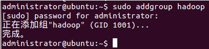
（ 在centos上需要将addgroup改为groupadd）
2.2创建hadoop用户
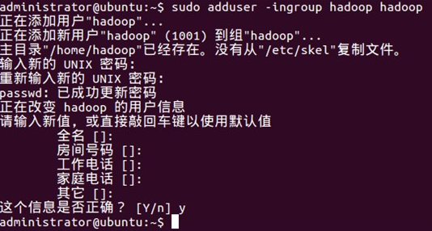
（在centos需要将adduser改为useradd，并设置密码为hadoop）画
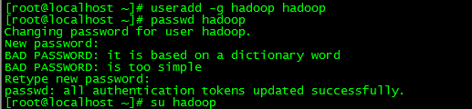
2.3给hadoop用户添加权限，打开/etc/sudoers文件

（centos可以直接使用vi代替gedit）
在root  ALL=(ALL:ALL)  ALL后添加hadoop  ALL=(ALL:ALL) ALL
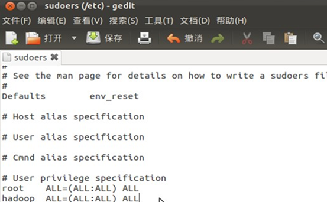

**三、修改主机名**
集群中需要给每台机器取个不同的名字。Ubuntu中机器名由 /etc/hostname文件决定。
3.1打开/etc/hostname文件

3.2回车后就打开/etc/hostname文件了，将/etc/hostname文件中的ubuntu改为你想取的机器名，如master、slave1、slave2。
3.3重启系统（reboot）后生效。
（如果是centos，则需要修改/etc/sysconfig/network文件）


**四、修改host文件**
将集群中各主机名对应的IP添加到每台主机的host文件中
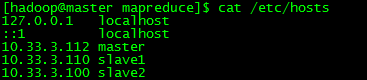

**五、添加无密码SSH服务**
5.1安装openssh-server   

（注：自动安装openssh-server时，可能会进行不下去，可以先进行如下操作：)


更新的快慢取决于网速，如果中途因为时间过长中断了更新（ctrl+z），当再次更新时，会更新不了，报错为：“Ubuntu无法锁定管理目录（/var/lib/dpkg/），是否有其他进程占用它？“需要如下操作


操作完成后继续执行第1步
如果是centos则使用yum代替apt-get


5.2生成RSA对称密码

ssh-keygen -t rsa
回车后会在~/.ssh/下生成两个文件：
id_rsa是私钥
id_rsa.pub是公钥
5.3进入~/.ssh/目录下，将id_rsa.pub追加到插头授权文件中

5.4本机测试

( 注：当ssh远程登录到其它机器后，现在你控制的是远程的机器，需要执行退出命令才能重新控制本地主机。) 


【切记】
SSH中密钥文件的权限值必须都设为600
sudo chmod 600 /home/hadoop/.ssh/*
**六、节点间使用SSH连接**
6.1将**各节点**的id_rsa.pub公钥拷贝到**各节点的**authorized_keys内，就可以实现各节点之间的无SSH密码通讯


 6.2测试连接
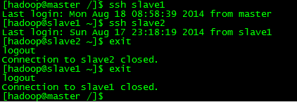

关于SSH的通讯原理，这里不做详述，有兴趣的话可以看看博客
http://qindongliang.iteye.com/blog/1958518 介绍的很详细的样子

**七、安装JDK**
我们选择的是jdk1.6.0_30版本,安装文件名为jdk-6u30-linux-i586.bin.
**7.1复制jdk到安装目录**
我们指定的安装目录是：/usr/local/java，先创建一个java文件夹 


再将bin文件拷贝进去
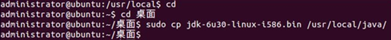

**7.2安装jdk**
切换到root用户下

**（注：如果因忘记密码而认证失败，可以先修改root用户的密码，再执行）**

运行jdk-6u30-linux-i586.bin


（注：如果遇到权限问题，可以先更改jdk-6u30-linux-i586.bin权限） 


更改权限后再执行上一步，当看到下图情况时，说明你安装成功了。
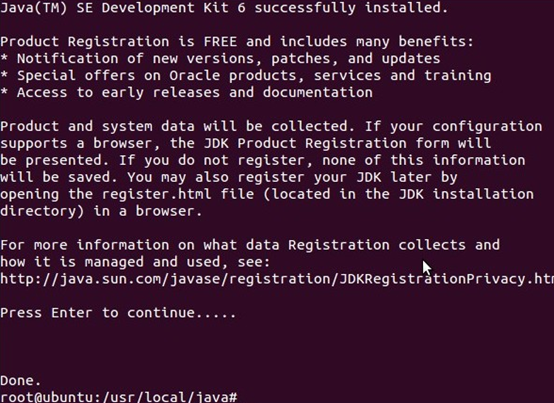

**这时在/usr/local/java目录下就多了一个jdk1.6.0_30文件夹**


**7.3配置环境变量**
（1）打开/etc/profile文件


**（2）添加变量如下：**
\# /etc/profile: system-wide .profile file for the Bourne shell (sh(1)) 
\# and Bourne compatible shells (bash(1), ksh(1), ash(1), ...). 
\#set java environment  
export JAVA_HOME=/usr/local/java/jdk1.6.0_30  
export JRE_HOME=/usr/local/java/jdk1.6.0_30/jre  
export CLASSPATH=.:$JAVA_HOME/lib:$JRE_HOME/lib:$CLASSPATH  
export PATH=$JAVA_HOME/bin:$JRE_HOME/bin:$JAVA_HOME:$PATH  
（注：为了以后集群工作的方便，这里建议每台机器的java环境最好一致。）
一般更改/etc/profile文件后，需要重启机器才能生效。这里介绍一种不用重启使其生效的方法


**（3）查看java环境变量是否配置成功** 
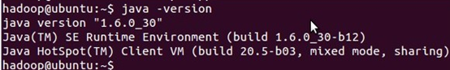

**八、下载解压Hadoop**
官网下载http://www.apache.org/dyn/closer.cgi/hadoop/core/
hadoop集群中每个机器上面的配置基本相同，所以我们先在master上面进行配置部署，然后再复制到其他节点。所以这里的安装过程相当于在每台机器上面都要执行。
【注意】：master和slaves安装的hadoop路径要完全一样，用户和组也要完全一致
解压文件到/usr路径下，并重命名
tar  zxvf hadoop-2.2.0_x64.tar.gz
mv hadoop-2.2.0 hadoop
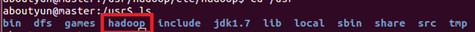
（解压命令在Ubuntu是 tar -zxf xxx.tar.gz，centos是tar zxvf xxx.tar.gz）
**九、Hadoop配置文件**
9.1创建必要文件夹
在master本地文件系统创建以下文件夹：
~/dfs/name
~/dfs/data
~/tmp
注意文件所属用户及用户组。如果不在新建的用户组下面，可以使用chown命令来修改：（chmod和chown命令的用法http://www.aboutyun.com/thread-7675-1-1.html)
9.2这里要涉及到的配置文件有7个
~/hadoop-2.2.0/etc/hadoop/hadoop-env.sh
~/hadoop-2.2.0/etc/hadoop/yarn-env.sh
~/hadoop-2.2.0/etc/hadoop/slaves
~/hadoop-2.2.0/etc/hadoop/core-site.xml
~/hadoop-2.2.0/etc/hadoop/hdfs-site.xml
~/hadoop-2.2.0/etc/hadoop/mapred-site.xml
~/hadoop-2.2.0/etc/hadoop/yarn-site.xml
以上文件有些默认不存在的，可以复制相应的.template文件获得
9.3配置文件1：hadoop-env.sh
修改JAVA_HOME值（export JAVA_HOME=/usr/jdk1.7）
9.4配置文件2：yarn-env.sh
修改JAVA_HOME值（export JAVA_HOME=/usr/jdk1.7）
9.5配置文件3：slaves（这个文件里面保存所有slave节点）
写入以下内容：
slave1
slave2
9.6配置文件4：core-site.xml
```
<configuration>
​    <property>
​        <name>fs.defaultFS</name>
​        <value>hdfs://master:8020</value>
​    </property>
​    <property>
​        <name>io.file.buffer.size</name>
​        <value>131072</value>
​    </property>
​    <property>
​        <name>hadoop.tmp.dir</name>
​        <value>file:/home/hadoop/tmp</value>
​        <description>Abase for other temporary  directories.</description>
​    </property>
​    <property>
​        <name>hadoop.proxyuser.aboutyun.hosts</name>
​        <value>*</value>
​    </property>
​    <property>
​        <name>hadoop.proxyuser.aboutyun.groups</name>
​        <value>*</value>
​    </property>
</configuration>
```
9.7配置文件5：hdfs-site.xml
```
<configuration>
​    <property>
​        <name>dfs.namenode.secondary.http-address</name>
​        <value>master:9001</value>
​    </property>
   <property>
​       <name>dfs.namenode.name.dir</name>
​       <value>file:/home/hadoop/dfs/name</value>
​    </property>
   <property>
​       <name>dfs.datanode.data.dir</name>
​       <value>file:/home/hadoop/dfs/data</value>
​    </property>
​    <property>
​        <name>dfs.replication</name>
​        <value>3</value>
​    </property>
​    <property>
​         <name>dfs.webhdfs.enabled</name>
​         <value>true</value>
​     </property>
</configuration>
```
9.8配置文件6：mapred-site.xml
```
<configuration>
​     <property>            
​        <name>mapreduce.framework.name</name>
​        <value>yarn</value>
​      </property>
​     <property>
​         <name>mapreduce.jobhistory.address</name>
​         <value>master:10020</value>
​     </property>
​     <property>
​        <name>mapreduce.jobhistory.webapp.address</name>
​        <value>master:19888</value>
​    </property>
</configuration>
```
9.9配置文件7：yarn-site.xml
```
<configuration>
​    <property>
​        <name>yarn.nodemanager.aux-services</name>
​        <value>mapreduce_shuffle</value>
​    </property>
​    <property>                                
<name>yarn.nodemanager.aux-services.mapreduce.shuffle.class</name>
​        <value>org.apache.hadoop.mapred.ShuffleHandler</value>
​    </property>
​    <property>
​        <name>yarn.resourcemanager.address</name>
​        <value>master:8032</value>
​    </property>
​    <property>
​        <name>yarn.resourcemanager.scheduler.address</name>
​        <value>master:8030</value>
​    </property>
​    <property>
​      <name>yarn.resourcemanager.resource-tracker.address</name>
​       <value>master:8031</value>
   </property>
   <property>
​       <name>yarn.resourcemanager.admin.address</name>
​        <value>master:8033</value>
​    </property>
​    <property>
​        <name>yarn.resourcemanager.webapp.address</name>
​        <value>master:8088</value>
​    </property>
</configuration>
```
9.10将配置文件复制到其他节点
上面配置完毕，我们基本上完成了90%了剩下就是复制。我们也可以把整个hadoop复制过去（注意slaves文件不一样）
【注意】拷贝配置文件的时候修改文件所有者
sudo chown hadoop mapred-site.xml
【记得】最后检查一下
cat hadoop-env.sh
cat yarn-env.sh
cat slaves
cat core-site.xml
cat hdfs-site.xml
cat mapred-site.xml
cat yarn-site.xml
9.11在每台服务器内配置环境变量/etc/profile
export PATH=$PATH:/usr/local/hadoop/bin/
export PATH=$PATH:/usr/local/hadoop/sbin/
**十、启动Hadoop**
10.1格式化namenode
hdfs namenode –format
或则
hadoop namenode format
10.2启动hdfs
start-dfs.sh
此时在master上面运行的进程有：
namenode
secondarynamenode
slave节点上面运行的进程有：datanode
10.3启动yarn
start-yarn.sh
我们看到如下效果：
master有如下进程：
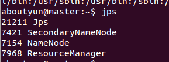

slave1有如下进程
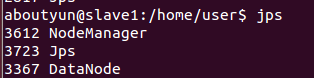

此时hadoop集群已全部配置完成！！！
**十一、查看Hadoop的Web管理窗口**
11.1 ResourceManager
介绍：运行在主节点master上
网址：http://master:8088/
配置文件：yarn-site.xml
<property>
  <name>yarn.resourcemanager.webapp.address</name>
  <value>master:8088</value>
</property>
【注】如果没有配置hosts，master将无法解析
要么你直接输入IP替代master，要么你就配置一下hosts，都很简单
Hosts文件地址C:\Windows\System32\drivers\etc


修改完后，正常的时候你会在浏览器里看到如下图

11.2 HDFS集群状态
网址：http://master:50070/

11.3 NodeManager
介绍：运行在从节点上
网址：http://slave1:8042/

11.4 JobHistory Server
启动：mr-jobhistory-daemon.sh start historyserver
网址：http://master:19888/
配置：mapreduce.jobhistory.webapp.address    

**十二、运行实例WordCount**
12.1 找到examples例子

在 /hadoop/share/hadoop/mapreduce下找到hadoop-mapreduce-examples-2.2.0.jar
12.2 运行前的准备工作
我们需要需要做一下运行需要的工作，比如输入输出路径，上传什么文件等。
①先在HDFS创建几个数据目录：
hadoop fs -mkdir -p /data/wordcount
hadoop fs -mkdir -p /output/

新建文件inputWord
vi /usr/inputWord
新建完毕，查看内容：
cat /usr/inputWord
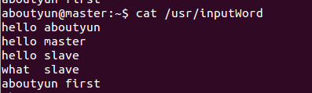

目录/data/wordcount用来存放Hadoop自带的WordCount例子的数据文件，
任务的结果输出到/output/wordcount目录中。
②将本地文件上传到HDFS中：
hadoop fs -put /usr/inputWord /data/wordcount/
查看上传后的文件情况
hadoop fs -ls /data/wordcount

查看文件的内容
hadoop fs -text /data/wordcount/inputWord

12.3 运行WordCount例子
hadoop jar /usr/hadoop/share/hadoop/mapreduce/hadoop-mapreduce-examples-2.2.0.jar wordcount /data/wordcount /output/wordcount

可以看到控制台输出程序运行的信息：
aboutyun@master:~$ hadoop jar /usr/hadoop/share/hadoop/mapreduce/hadoop-mapreduce-examples-2.2.0.jar wordcount /data/wordcount /output/wordcount
14/05/14 10:33:33 INFO client.RMProxy: Connecting to ResourceManager at master/172.16.77.15:8032
14/05/14 10:33:34 INFO input.FileInputFormat: Total input paths to process : 1
14/05/14 10:33:34 INFO mapreduce.JobSubmitter: number of splits:1
14/05/14 10:33:34 INFO Configuration.deprecation: user.name is deprecated. Instead, use mapreduce.job.user.name
14/05/14 10:33:34 INFO Configuration.deprecation: mapred.jar is deprecated. Instead, use mapreduce.job.jar
14/05/14 10:33:34 INFO Configuration.deprecation: mapred.output.value.class is deprecated. Instead, use mapreduce.job.output.value.class
14/05/14 10:33:34 INFO Configuration.deprecation: mapreduce.combine.class is deprecated. Instead, use mapreduce.job.combine.class
14/05/14 10:33:34 INFO Configuration.deprecation: mapreduce.map.class is deprecated. Instead, use mapreduce.job.map.class
14/05/14 10:33:34 INFO Configuration.deprecation: mapred.job.name is deprecated. Instead, use mapreduce.job.name
14/05/14 10:33:34 INFO Configuration.deprecation: mapreduce.reduce.class is deprecated. Instead, use mapreduce.job.reduce.class
14/05/14 10:33:34 INFO Configuration.deprecation: mapred.input.dir is deprecated. Instead, use mapreduce.input.fileinputformat.inputdir
14/05/14 10:33:34 INFO Configuration.deprecation: mapred.output.dir is deprecated. Instead, use mapreduce.output.fileoutputformat.outputdir
14/05/14 10:33:34 INFO Configuration.deprecation: mapred.map.tasks is deprecated. Instead, use mapreduce.job.maps
14/05/14 10:33:34 INFO Configuration.deprecation: mapred.output.key.class is deprecated. Instead, use mapreduce.job.output.key.class
14/05/14 10:33:34 INFO Configuration.deprecation: mapred.working.dir is deprecated. Instead, use mapreduce.job.working.dir
14/05/14 10:33:35 INFO mapreduce.JobSubmitter: Submitting tokens for job: job_1400084979891_0004
14/05/14 10:33:36 INFO impl.YarnClientImpl: Submitted application application_1400084979891_0004 to ResourceManager at master/172.16.77.15:8032
14/05/14 10:33:36 INFO mapreduce.Job: The url to track the job: http://master:8088/proxy/application_1400084979891_0004/
14/05/14 10:33:36 INFO mapreduce.Job: Running job: job_1400084979891_0004
14/05/14 10:33:45 INFO mapreduce.Job: Job job_1400084979891_0004 running in uber mode : false
14/05/14 10:33:45 INFO mapreduce.Job: map 0% reduce 0%
14/05/14 10:34:10 INFO mapreduce.Job: map 100% reduce 0%
14/05/14 10:34:19 INFO mapreduce.Job: map 100% reduce 100%
14/05/14 10:34:19 INFO mapreduce.Job: Job job_1400084979891_0004 completed successfully
14/05/14 10:34:20 INFO mapreduce.Job: Counters: 43
    File System Counters
        FILE: Number of bytes read=81
        FILE: Number of bytes written=158693
        FILE: Number of read operations=0
        FILE: Number of large read operations=0
        FILE: Number of write operations=0
        HDFS: Number of bytes read=175
        HDFS: Number of bytes written=51
        HDFS: Number of read operations=6
        HDFS: Number of large read operations=0
        HDFS: Number of write operations=2
    Job Counters 
        Launched map tasks=1
        Launched reduce tasks=1
        Data-local map tasks=1
        Total time spent by all maps in occupied slots (ms)=23099
        Total time spent by all reduces in occupied slots (ms)=6768
    Map-Reduce Framework
        Map input records=5
        Map output records=10
        Map output bytes=106
        Map output materialized bytes=81
        Input split bytes=108
        Combine input records=10
        Combine output records=6
        Reduce input groups=6
        Reduce shuffle bytes=81
        Reduce input records=6
        Reduce output records=6
        Spilled Records=12
        Shuffled Maps =1
        Failed Shuffles=0
        Merged Map outputs=1
        GC time elapsed (ms)=377
        CPU time spent (ms)=11190
        Physical memory (bytes) snapshot=284524544
        Virtual memory (bytes) snapshot=2000748544
        Total committed heap usage (bytes)=136450048
    Shuffle Errors
        BAD_ID=0
        CONNECTION=0
        IO_ERROR=0
        WRONG_LENGTH=0
        WRONG_MAP=0
        WRONG_REDUCE=0
    File Input Format Counters 
        Bytes Read=67
    File Output Format Counters 
        Bytes Written=51
12.4查看结果
hadoop fs -text /output/wordcount/part-r-00000
结果数据示例如下：
aboutyun@master:~$ hadoop fs -text /output/wordcount/part-r-00000
aboutyun    2
first    1
hello    3
master    1
slave    2
what    1
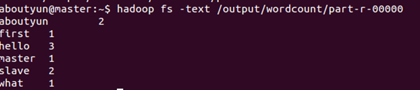
登录到Web控制台，访问链接http://master:8088/可以看到任务记录情况。 
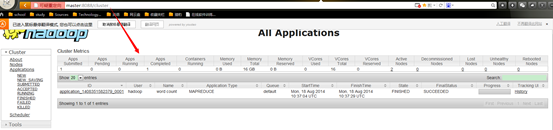   

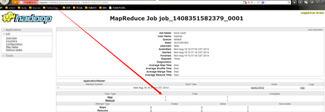  

**【转载博客】**
为虚拟机设置静态IP
http://java--hhf.iteye.com/admin/blogs/2100128
超详细单机版搭建hadoop环境图文解析 
http://weixiaolu.iteye.com/blog/1401931
超详细在Ubuntu下安装JDK图文解析
http://weixiaolu.iteye.com/blog/1401786
hadoop2.2完全分布式最新高可靠安装文档
http://www.aboutyun.com/thread-7684-1-1.html
hadoop2.X使用手册1：通过web端口查看主节点、slave1节点及集群运行状态
http://www.aboutyun.com/thread-7712-1-1.html
hadoop2.2使用手册2：如何运行自带wordcount
http://www.aboutyun.com/thread-7713-1-1.html
【问题集锦】
问题一：
master: Error: JAVA_HOME is not set and could not be found.
slave1: Error: JAVA_HOME is not set and could not be found.
slave2: Error: JAVA_HOME is not set and could not be found.  


[hadoop@master hadoop]$ start-dfs.sh 
14/08/18 08:51:05 WARN util.NativeCodeLoader: Unable to load native-hadoop library for your platform... using builtin-java classes where applicable
Starting namenodes on [master]
master: Error: JAVA_HOME is not set and could not be found.
slave1: Error: JAVA_HOME is not set and could not be found.
slave2: Error: JAVA_HOME is not set and could not be found.
Starting secondary namenodes [master]
master: Error: JAVA_HOME is not set and could not be found.
14/08/18 08:51:10 WARN util.NativeCodeLoader: Unable to load native-hadoop library for your platform... using builtin-java classes where applicable
[hadoop@master hadoop]$ $JAVA_HOME
bash: /usr/local/java/jdk1.6.0_43: is a directory
[hadoop@master hadoop]$ start-yarn.sh 
starting yarn daemons
starting resourcemanager, logging to /usr/local/hadoop/logs/yarn-hadoop-resourcemanager-master.out
slave1: Error: JAVA_HOME is not set and could not be found.
slave2: Error: JAVA_HOME is not set and could not be found.
[hadoop@master hadoop]$ jps
2158 ResourceManager
2415 Jps
[hadoop@master hadoop]$

解决办法：  
  

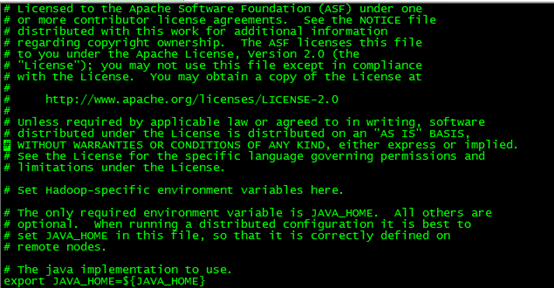  

改为
  

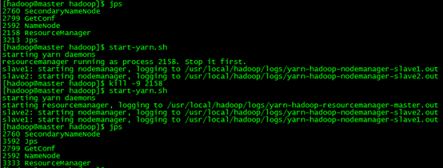  

问题二：无法启动NodeManager
NodeManager启动失败。查看日志，记录错误如下：
2014-02-10 18:24:07,635 FATAL org.apache.hadoop.yarn.server.nodemanager.NodeManager: Error starting NodeManager
org.apache.hadoop.yarn.YarnException: Failed to Start 
org.apache.hadoop.yarn.server.nodemanager.NodeManager
at org.apache.hadoop.yarn.service.CompositeService.start(CompositeService.java:78)
at org.apache.hadoop.yarn.server.nodemanager.NodeManager.start(NodeManager.java:196)
at org.apache.hadoop.yarn.server.nodemanager.NodeManager.initAndStartNodeManager
(NodeManager.java:329)
at org.apache.hadoop.yarn.server.nodemanager.NodeManager.main(NodeManager.java:351)
Caused by: org.apache.hadoop.yarn.YarnException: Failed to Start org.apache.hadoop.yarn.server.nodemanager.containermanager.ContainerManagerImpl
at org.apache.hadoop.yarn.service.CompositeService.start(CompositeService.java:78)
at org.apache.hadoop.yarn.server.nodemanager.containermanager.ContainerManagerImpl.start(ContainerManagerImpl.java:248)
​    at org.apache.hadoop.yarn.service.CompositeService.start(CompositeService.java:68)
​    ... 3 more
Caused by: org.apache.hadoop.yarn.YarnException: Failed to check for existence of remoteLogDir [/var/log/hadoop-yarn/apps]
​    at org.apache.hadoop.yarn.server.nodemanager.containermanager.logaggregation.LogAggregationService.verifyAndCreateRemoteLogDir(LogAggregationService.java:179)
​    at org.apache.hadoop.yarn.server.nodemanager.containermanager.logaggregation.LogAggregationService.start(LogAggregationService.java:132)
at org.apache.hadoop.yarn.service.CompositeService.start(CompositeService.java:68)
​    ... 5 more
2014-02-10 18:24:07,647 INFO org.apache.hadoop.ipc.Server: Stopping server on 52154
日志显示：无法启动NodeManager，无法启动ContainerManager（也就是没有分配资源容器管理进程），也无法检查远程日志目录（在HDFS上），原因锁定，无法与Master（具体来说是ResourceManager）通信，然后到master上查看防火墙是否关闭，将Master上的防火墙关闭，并且chkconfig iptables off进行永久关闭（重启后不会自动开启），再去Slave节点上启动NodeManager

问题三：No route to host


[配置Hadoop集群：java.net.NoRouteToHostException: ](http://flychao88.iteye.com/blog/1950081)
<span style="font-size: 14px;">2012-07-04 18:43:31,479 ERROR org.apache.hadoop.hdfs.server.datanode.DataNode: java.io.IOException: Call to /192.168.18.218:9000 failed on local exception: java.net.NoRouteToHostException: 没有到主机的路由 
</span> 
在配置hadoop的时候，很容易遇到以上错误，遇到以上问题的时候，一般可以通过以下几种方法解决。 
1、从namenode主机ping其它主机名（如：ping slave1），如果ping不通,原因可能是namenode节点的/etc/hosts配置错误。
2、从datanode主机ping namenode主机名，如果ping不通,原因可能是datenode节点的/etc/hosts配置的配置错误。
3、查看namenode主机的9000（具体根据core-site.xml中的fs.default.name节点配置）端口，是否打开.
vi /etc/sysconfig/iptables 打开配置文件加入如下语句:
-A INPUT -p tcp -m state --state NEW -m tcp --dport 8080 -j ACCEPT  
重启防火墙
/etc/init.d/iptables restart 
查看端口状态
/etc/init.d/iptables status
4、关闭系统防火墙。这是最容易出现的问题。用此命令service iptables stop关闭后，一切正常集群正常使用

> @ 学必求其心得，业必贵其专精
> @ WHAT - HOW - WHY
> @ 不积跬步 - 无以至千里
