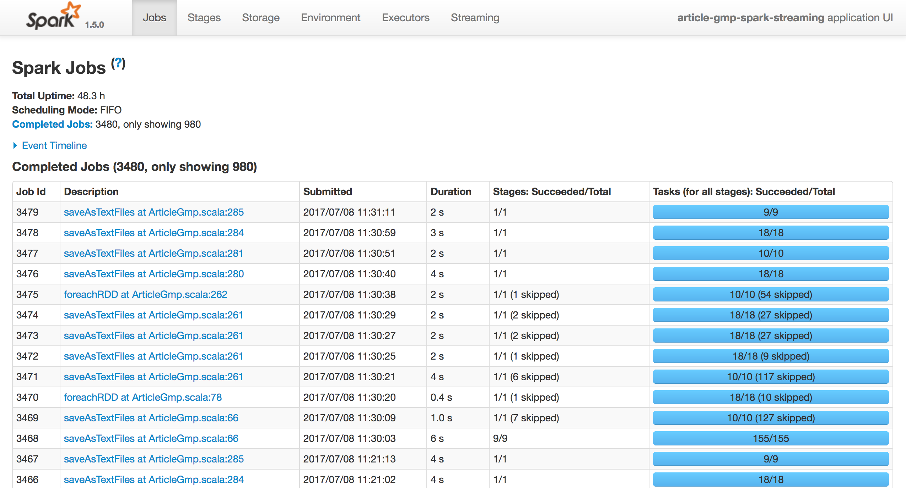
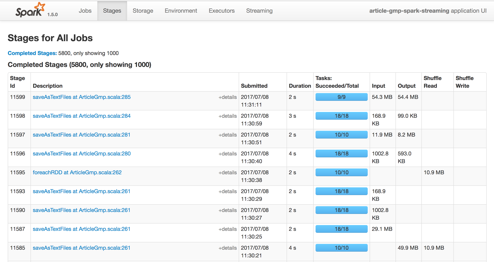

# Spark_Running

### 一、工程打包
#### 1.1 Maven

```shell
mvn clean
mvn package
jar tf target/*jar
```

#### 1.2 sbt

```shell
sbt clean
sbt package
jar tf target/scala-2.10/*jar
```

### 二、Spark Submit
#### 2.1 启动
```shell
$ ./bin/spark-submit 
    --master yarn \
    --deploy-mode cluster \
    --driver-memory 4g \
    --executor-memory 2g \
    --executor-cores 1 \
    --queue thequeue \    
    --jars my-other-jar.jar,my-other-other-jar.jar \
    --class org.apache.spark.examples.SparkPi \
    lib/spark-examples*.jar \
    app_arg1 app_arg2
```
```shell
#!\bin\bash

SPARK_SUBMIT_SCRIPT=${SPARK_HOME}/bin/spark-submit
ASSEMBLY_JAR=./target/*0.0.1.jar

${SPARK_SUBMIT_SCRIPT} \
    --class com.oreilly.learningsparkexamples.scala.WordCount \
    ${ASSEMBLY_JAR} local

```

#### 2.2 Spark Conf参数配置
http://spark.apache.org/docs/latest/configuration.html#application-properties
| 常用参数          | 描述                                                         |
| ----------------- | ------------------------------------------------------------ |
| --master          | 表示要连接的集群管理器                                       |
| --deploy-mode     | 选择驱动器程序的位置，1)本地客户端“client”，即在 spark-submit 被调用的这台机器上启动； 2）集群“cluster”，即驱动器程序会被传输并执行 于集群的一个工作节点上。默认是本地模式 |
| --class           | 运行 Java 或 Scala 程序时应用的主类                          |
| --name            | 应用的显示名，会显示在 Spark 的网页用户界面中                |
| --jars            | 需要上传并放到应用的 CLASSPATH 中的 JAR                      |
| --files           | 需要放到应用工作目录中的文件的列表。这个参数一般用来放需要分发到各节点的 数据文件 |
| --executor-memory | 执行器进程使用的内存量，以字节为单位。可以使用后缀指定更大的单位，比如 “512m”(512 MB)或“15g”(15 GB) |
| --driver-memory   | 驱动器进程使用的内存量，以字节为单位。可以使用后缀指定更大的单位，比如 “512m”(512 MB)或“15g”(15 GB) |

- Spark中可以设置参数的地方有四，优先级从高到低分别是  

  1、程序设定set
```scala
// 创建一个conf对象
val conf = new SparkConf()
conf.set("spark.app.name", "My Spark App") 
conf.set("spark.master", "local[4]") 
conf.set("spark.ui.port", "36000") 
// 重载默认端口配置
// 使用这个配置对象创建一个SparkContext 
val sc = new SparkContext(conf)
```

2、spark submit 传参数指定
```shell
spark-submit \
   --class com.example.MyApp \
   --master local[4] \
   --name "My Spark App" \
   --conf spark.ui.port=36000 \
   myApp.jar
```

3、spark submit 传配置文件设定

```shell
spark-submit \
   --class com.example.MyApp \
   --properties-file my-config.conf \
   myApp.jar
   
## Contents of my-config.conf ##
spark.master    local[4]
spark.app.name  "My Spark App"
spark.ui.port   36000
```

4、调用系统默认值
```
Spark 安装目录中找到 conf/spark-defaults.conf 文件，尝试读取该文件中以空格隔开的键值对数据
```


## 三、运行参数详解
### 3.1 --master
http://spark.apache.org/docs/latest/submitting-applications.html
| 值                | 描述                                                         |
| ----------------- | ------------------------------------------------------------ |
| spark://host:port | 连接到指定端口的 Spark 独立集群上。默认情况下 Spark 独立主节点使用 7077 端口 |
| mesos://host:port | 连接到指定端口的 Mesos 集群上。默认情况下 Mesos 主节点监听 5050 端口 |
| yarn              | 连接到一个 YARN 集群。当在 YARN 上运行时，需要设置环境变量 HADOOP _CONF_DIR 指向 Hadoop 配置目录，以获取集群信息 |
| local             | 运行本地模式，使用单核                                       |
| local[N]          | 运行本地模式，使用 N 个核心                                  |
| local[*]          | 运行本地模式，使用尽可能多的核心                             |

### 四、集群管理器
#### 4.1 Saprk自带的独立集群管理器
http://spark.apache.org/docs/latest/spark-standalone.html
- 启动独立集群管理器

```
(1) 将编译好的 Spark 复制到所有机器的一个相同的目录下，比如 /home/yourname/spark。
(2) 设置好从主节点机器到其他机器的 SSH 无密码登陆。这需要在所有机器上有相同的用 户账号，并在主节点上通过 ssh-keygen 生成 SSH 私钥，然后将这个私钥放到所有工作 节点的 .ssh/authorized_keys 文件中。如果你之前没有设置过这种配置，你可以使用如下 命令:
# 在主节点上:运行ssh-keygen并接受默认选项
$ ssh-keygen -t dsa
Enter file in which to save the key (/home/you/.ssh/id_dsa): [回车] Enter passphrase (empty for no passphrase): [空]
Enter same passphrase again: [空]
# 在工作节点上:
# 把主节点的~/.ssh/id_dsa.pub文件复制到工作节点上，然后使用: $ cat ~/.ssh/id_dsa.pub >> ~/.ssh/authorized_keys
$ chmod 644 ~/.ssh/authorized_keys
(3) 编辑主节点的 conf/slaves 文件并填上所有工作节点的主机名。
(4) 在主节点上运行 sbin/start-all.sh(要在主节点上运行而不是在工作节点上)以启动集群。 如果全部启动成功，你不会得到需要密码的提示符，而且可以在 http://masternode:8080 看到集群管理器的网页用户界面，上面显示着所有的工作节点。
(5) 要停止集群，在主节点上运行 bin/stop-all.sh。
```

- 检查管理器是否正常

```shell
spark-shell --master spark://masternode:7077
```

- 提交程序

```shell
spark-submit --master spark://masternode:7077 yourapp

管理界面
http://masternode:8080
正常情况下
(1)应用连接上了(即出现在了 Running Applications 中);
(2) 列出的所使用的核心和内存均大于 0。
```
- 说明
> 执行器进程申请的内存(--executor-memory值)超过了集群所能提供的内存总量，独立集群管理器始终无法为应用分配执行器节点  

> 独立集群管理器支持两种部署模式（--deploy-mode），client（默认，驱动器程序就是你提交任务的机器）和 cluster（驱动器程序运行在集群的某个工作节点）

> 如果你有一个集群（20台物理节点，每个节点4cores），当你提交一个任务（8cores，每个core1G），默认情况下，Spark将会在8台物理节点上召唤起8个core，每个core1G，当然我们也可以通过配置spark.deploy.spreadOut=false来要求申请尽可能少的物理节点，比如2台物理节点、2*4cores

#### 4.2 YARN
http://spark.apache.org/docs/latest/running-on-yarn.html

- 配置并提交任务
```
(1) 设置环境变量 HADOOP_CONF_DIR。这个目录 包含 yarn-site.xml 和其他配置文件;如果你把 Hadoop 装到 HADOOP_HOME 中，那么这 个目录通常位于 HADOOP_HOME/conf 中，否则可能位于系统目录 /etc/hadoop/conf 中
(2) 然后用如下方式提交你的应用:
    export HADOOP_CONF_DIR="..."
    spark-submit --master yarn yourapp
```

#### 4.3 Mesos

http://spark.apache.org/docs/latest/running-on-mesos.html

- 执行器之间的资源共享，分为细粒度模式（默认，执行器cores的数量会随着任务的执行而变化），和粗粒度模式（spark.mesos.coarse=true, 比较适合streaming这样的高实效性任务，减少core调度之间的延迟）

#### 4.4 EC2

http://spark.apache.org/docs/latest/ec2-scripts.html

- 比较适合搭配S3

### 五、任务管理界面
- Jobs \ Stages 方便查看各个任务的执行时间

- 
- Storage 表示已缓存的RDD信息

- Environment 可以查看我们设置的配置信息

- Executors 各个节点的执行和配置情况


### 六、程序运行调优
#### 6.1 优化分区数、并行度
- 在数据混洗的时候传合理的参指定并行度

- 对已有的数据进行从新分区 repartition、减少分区数coalesce
```
# 以可以匹配数千个文件的通配字符串作为输入
>>> input = sc.textFile("s3n://log-files/2014/*.log")
>>> input.getNumPartitions()
35154
# 排除掉大部分数据的筛选方法
>>> lines = input.filter(lambda line: line.startswith("2014-10-17")) >>> lines.getNumPartitions()
35154
# 在缓存lines之前先对其进行合并操作
>>> lines = lines.coalesce(5).cache()
>>> lines.getNumPartitions()
4
# 可以在合并之后的RDD上进行后续分析
>>> lines.count()
```

#### 6.2 设置kyro的系列化方式
org.apache.spark.serializer.KryoSerializer会优于默认的java序列化的库
- 普通的序列化
```
val conf = new SparkConf()
conf.set("spark.serializer", "org.apache.spark.serializer.KryoSerializer")
```

- 有注册过的序列化
```
val conf = new SparkConf()
conf.set("spark.serializer", "org.apache.spark.serializer.KryoSerializer")
conf.registerKryoClasses(Array(classOf[MyClass], classOf[MyOtherClass]))

```

- 有强制要求必须注册的序列化
```
val conf = new SparkConf()
conf.set("spark.serializer", "org.apache.spark.serializer.KryoSerializer")
// 严格要求注册类
conf.set("spark.kryo.registrationRequired", "true")
conf.registerKryoClasses(Array(classOf[MyClass], classOf[MyOtherClass]))

```

#### 6.3 修改内存使用策略
1、重新分配RDD存储、数据混洗聚合存储、用户存储占比  
2、改进缓存策略，比方说MEMORY_ONLY 改为 MEMORY_AND_DISK，当数据缓存空间不够的时候就不会删除旧数据导致重新加载计算，而是直接从磁盘load数据；再比方说MEMORY_ONLY 改为 MEMORY_AND_DISK_SER 或者 MEMORY_ONLY_SER，虽然增加了序列化的时间，但是可以大量的减少GC的时间

#### 6.4 硬件优化
1、双倍的硬件资源（CPU、Core）往往能带来应用时间减半的效果  
2、更大的本地磁盘可以帮助提高Spark的应用性能

> @ 学必求其心得，业必贵其专精
> @ WHAT - HOW - WHY
> @ 不积跬步 - 无以至千里