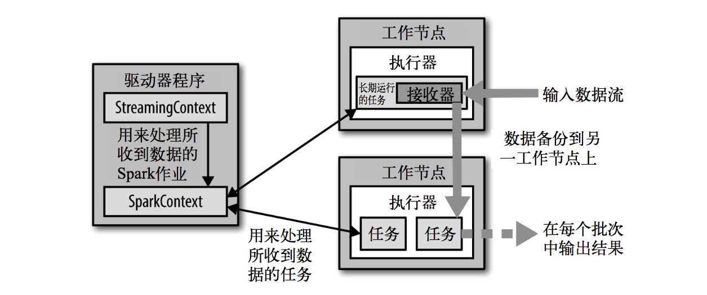
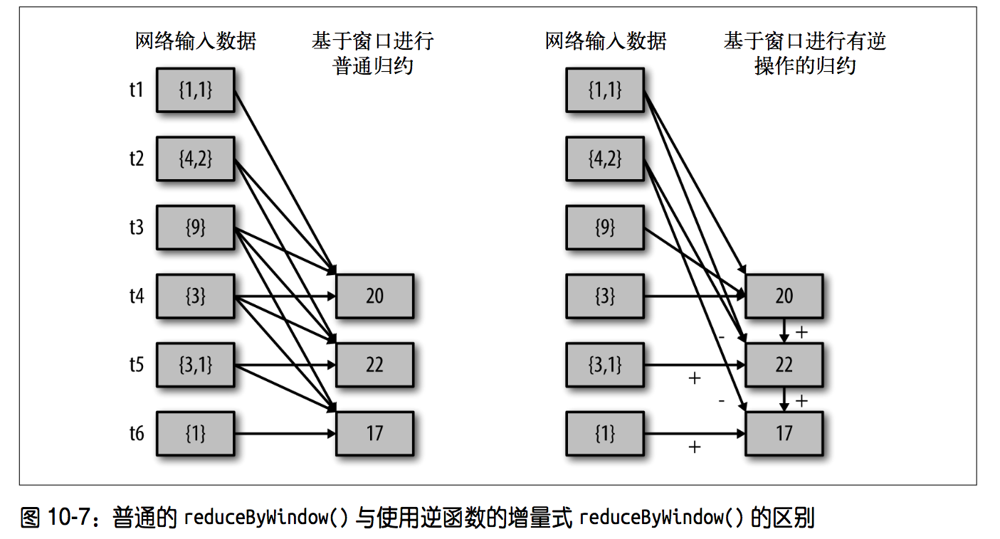
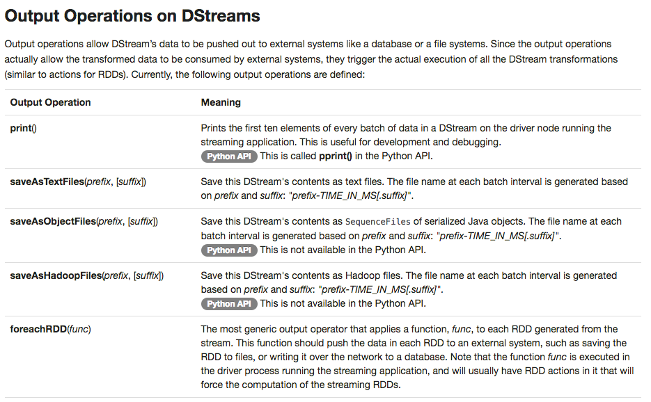

# Spark Streaming Quick Start

Spark Streaming的基本数据结构是DRDD（discretized stream），DRDD和RDD类似，但是引入了时间的概念。DRDD中三个最重要的时间变量
- windowDuration，每次处理的时间窗口大小
- slideDuration，本次处理和下一次处理之间的滑动时间间隔
- batchInterval，DRDD里面每一个RDD缓存的数据时间  

为了保证数据的可容灾性，DRDD里面新加了**checkpoint**的机制，数据可以从任何一个checkpoint恢复，以确保任务能够7*24小时执行  

Spark Streaming的操作分为转化和输出，不同于RDD的转化和行动 
[官网](https://spark.apache.org/docs/latest/streaming-programming-guide.html)

### 一、Demo

```scala
/**
  * @description
  * 监听localhost的7777端口，处理每一行的输入
  * nc -lk 7777 开启端口 发送数据
  * 运行代码
  * spark-submit --class com.hhf.spark.streaming.StreamingSocket ./sparkStreamingExample.jar 192.168.9.223 7777
  * @version V1.0
  * @author HHF
  * @time 2016-5-24
  */

import org.apache.spark.streaming.dstream.DStream
import org.apache.spark.SparkConf
import org.apache.spark.streaming.Seconds
import org.apache.spark.streaming.StreamingContext

object StreamingSocket {
    def main(args: Array[String]) {
        if (args.length < 2) {
            System.err.println("Usage: NetworkWordCount <hostname> <port>")
            System.exit(1)
        }

        val conf = new SparkConf()
        conf.setAppName("StreamingSocket")
        conf.setMaster("local")
        // Create a StreamingContext with a 1 second batch size
        val ssc = new StreamingContext(conf, Seconds(10))
        // Create a DStream from all the input on port 7777
        val lines = ssc.socketTextStream(args(0), args(1).toInt)
        val errorLines = processLines(lines)
        // Print out the lines with errors, which causes this DStream to be evaluated
        errorLines.print()
        // start our streaming context and wait for it to "finish"
        ssc.start()
        // Wait for 10 seconds then exit. To run forever call without a timeout
        ssc.awaitTermination()
        ssc.stop()
    }

    def processLines(lines: DStream[String]) = {
        // Filter our DStream for lines with "error"
        lines.filter(_.contains("error"))
    }
}

## 建议直接走官网的详细demo
```

### 二、架构设计

参考来自《Saprk快速大数据分析》，很详细清楚的说明了spark streaning的执行过程。针对每一种数据源，都将有一个与之对应的长期运行的接收器，所以收到的数据都会有一个备份，任务的执行都将发生在副本上，万一数据丢失，将直接从接收器上重新将数据copy过来。

Spark Streaming的运行模式可以根据带不带window分为以下两种
#### 2.1 每个batchInterval执行一次，无状态的运行


#### 2.2 指定windowDuration、slideDuration的运行，每次移动特定的步伐，运行一个window里面的所有数据


### 三、转化
#### 3.1 无状态转化
每批次的任务数据和之前的批次数据没有任何关系，无状态转化的操作和普通RDD的转化十分类似，强调transform函数，transform()的常见应用场景就是重用RDD的处理函数 
```scala
val outlierDStream = accessLogsDStream.transform { rdd =>
       extractOutliers(rdd)
}
```
#### 3.2 有状态转化
每批次的任务数据和之前的批次数据有交集，有交集就可以有优化，尽量使得所有的数据只需要被处理一次
##### 3.2.1 基于于滑动窗口


```scala
val ipDStream = accessLogsDStream.map(logEntry => (logEntry.getIpAddress(), 1))
val ipCountDStream = ipDStream.reduceByKeyAndWindow(
    {(x, y) => x + y}, // for new
    {(x, y) => x - y}, // for old
    Seconds(30), // windowDuration
    Seconds(10)  // slideDuration
)
```

##### 3.2.2 状态更新 updateStateByKey
用来一直追踪一个事件的状态
```scala
def updateRunningSum(values: Seq[Long], state: Option[Long]) = {
       Some(state.getOrElse(0L) + values.size)
}
val responseCodeDStream = accessLogsDStream.map(log => (log.getResponseCode(), 1L)) 
val responseCodeCountDStream = responseCodeDStream.updateStateByKey(updateRunningSum _)
```

### 四、输出


### 五、容灾
#### 5.1 checkpoint
```scala
ssc.checkpoint("hdfs://...")
```
#### 5.2 driver程序容灾
使用StreamingContext.getOrCreate()函数，可以重新从检查点目录中初始化出streamingContext然后继续处理
```scala
StreamingContext.getOrCreate()
```
spark独立管理器还可以设置参数来监控程序，自动拉起任务
#### 5.3 executor节点容灾
数据在多个工作节点上备份
#### 5.4 接收器容灾
将数据备份，允许一台工作节点数据丢失

> @ 学必求其心得，业必贵其专精
> @ WHAT - HOW - WHY
> @ 不积跬步 - 无以至千里