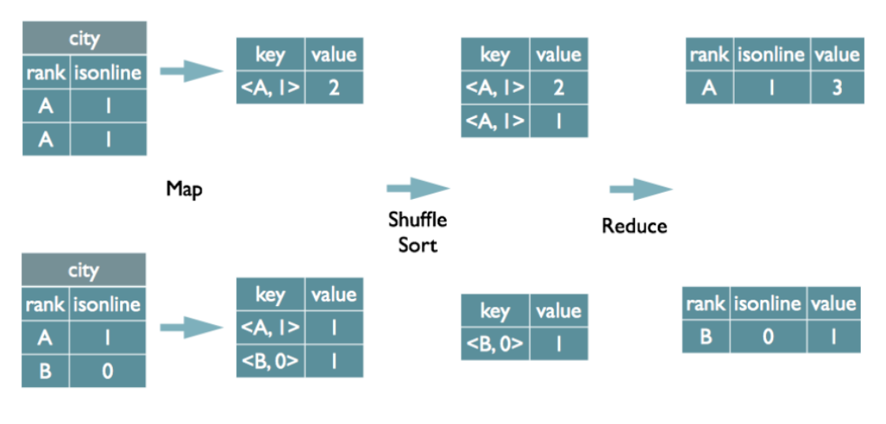
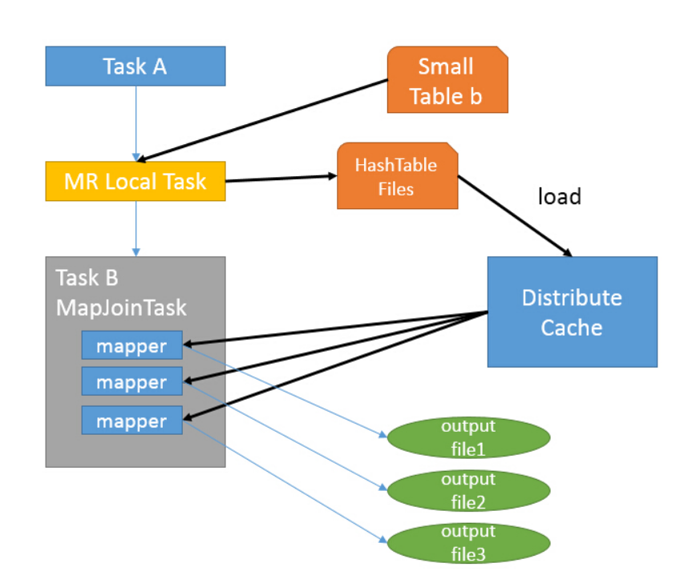

[toc]

# Hive划重点

## 一、join、mapjoin的执行过程

JOIN分成REDUCE JOIN 和 MAP JOIN

### REDUCE JOIN

reduce join 又可以称为common join、shuffle join、join  
join的执行过程可以分为map、shuffle、reduce三个阶段  

```
SELECT 
    a.id,a.dept,b.age 
FROM a JOIN b 
ON (a.id = b.id);
```




- map 阶段
1. 读取源数据表数据
2. 解析成<key. value>结构，key是where条件字段，value是表名tag+select需要查询出的字段内容
3. 根据key排序

- shuffle 阶段
1. 根据key进行hash，根据hash值分配到不同的reduce节点

- reduce 阶段
1. 根据key进行join操作

### MAP JOIN

map join的执行流程中已经不再具有reduce阶段，和shuffle阶段，直接从map端输出结果


1. 在客户端本地执行Task A，读取小表b的数据，将其转换成hash的<key， value>结构
2. 在客户端生成一个本地文件HashTableFile
3. 将文件加载到DistributeCache中
4. 启动mapTask扫描大表数据，每一条记录根据内存中缓存的b表数据计算，处理并输出结果

> MAP JOIN带来的优势
- 小表连接大表，缩短运行时间
- 需要在join中使用不等式条件的时候，可以将on改为where，where就是在map阶段执行的

## 二、什么情况下会出现数据倾斜，要怎么处理

| 算子           | 场景                                    | 分析                                    | 解决                           |
| -------------- | --------------------------------------- | --------------------------------------- | ------------------------------ |
| join           | 大表join小表，小表key比较集中           | 分发到一个或某几个reduce上的数据量较大  | 改成mapjoin                    |
| join           | 大表join大表，0值或者空值过多           | 这类异常值均由一个reduce处理，数据倾斜  | 异常值先处理，后join           |
| join           | on条件同一个字段里既有string也有int类型 | 默认所有string的key会分配到同一个reduce | 等号两边数据类型转换成int      |
| group by       | 数据分布不均匀，某个或某几个Key特别多   | 分发到一个或某几个reduce上的数据量较大  | 单独处理、加随机数，分两次聚合 |
| count distinct | 数据分布不均匀，某个或某几个Key特别多   | 分发到一个或某几个reduce上的数据量较大  | 单独处理、加随机数，分两次聚合 |

原因归类

1）业务场景导致key值分布不均，比如空值就是会异常多

2）SQL脚本待优化，比如全局count(distinct)，reduce=1

解决方案归类

1）参数优化

```sql
-- Map 端部分聚合，相当于Combiner
hive.map.aggr = true；
-- 有数据倾斜的时候进行负载均衡
hive.groupby.skewindata=true；

-- 有数据倾斜的时候进行负载均衡，当选项设定为 true，
-- 生成的查询计划会有两个 MR Job
-- 第一个 MR Job 中，Map 的输出结果集合会随机分布到 Reduce 中，每个 Reduce 做部分聚合操作，并输出结果，这样处理的结果是相同的 Group By Key 有可能被分发到不同的 Reduce 中，从而达到负载均衡的目的；
-- 第二个 MR Job 再根据预处理的数据结果按照 Group By Key 分布到 Reduce 中（这个过程可以保证相同的 Group By Key 被分布到同一个 Reduce 中），最后完成最终的聚合操作。
```

2）数据优化

​    join前将异常值裁剪过滤

3）SQL优化

​    优先mapjoin

​    手动随机数，分两层执行

​    单独处理异常大key，在union聚合


## 三、Hive架构


1）用户接口：Client
  CLI（command-line interface）、JDBC/ODBC(jdbc访问hive)、WEBUI（浏览器访问hive）
2）元数据：Metastore
  元数据包括：表名、表所属的数据库（默认是default）、表的拥有者、列/分区字段、表的类型（是否是外部表）、表的数据所在目录等；
  默认存储在自带的derby数据库中，推荐使用MySQL存储Metastore
3）Hadoop
  使用HDFS进行存储，使用MapReduce进行计算。
4）驱动器：Driver
  （1）解析器（SQL Parser）：将SQL字符串转换成抽象语法树AST，这一步一般都用第三方工具库完成，比如antlr；对AST进行语法分析，比如表是否存在、字段是否存在、SQL语义是否有误。
  （2）编译器（Physical Plan）：将AST编译生成逻辑执行计划。
  （3）优化器（Query Optimizer）：对逻辑执行计划进行优化。
  （4）执行器（Execution）：把逻辑执行计划转换成可以运行的物理计划。对于Hive来说，就是MR/Spark

## 四、Hive的HSQL转换为MapReduce的过程

HiveSQL ->AST(抽象语法树) -> QB(查询块) ->OperatorTree（操作树）->优化后的操作树->mapreduce任务树->优化后的mapreduce任务树


过程描述如下：
    SQL Parser：Antlr定义SQL的语法规则，完成SQL词法，语法解析，将SQL转化为抽象语法树AST Tree；
    Semantic Analyzer：遍历AST Tree，抽象出查询的基本组成单元QueryBlock；
    Logical plan：遍历QueryBlock，翻译为执行操作树OperatorTree；
    Logical plan optimizer: 逻辑层优化器进行OperatorTree变换，合并不必要的ReduceSinkOperator，减少shuffle数据量；
    Physical plan：遍历OperatorTree，翻译为MapReduce任务；
    Logical plan optimizer：物理层优化器进行MapReduce任务的变换，生成最终的执行计划

```sql
 SELECT sgametabledb, sgametable, iqpsact
 FROM linksee_ret_table_rowcount_qps
 WHERE dtstatdate=20210510 AND iqpsact>1000
```


## 五、Hive底层与数据库交互

Hive将元数据存储在RDBMS（Relational Database Management System）中，比如存储在MySQL、Derby中。元数据信息包括：存在的表、表的列、权限和更多的其他信息


## 六、Hive VS RDBMS


## 七、Hive内表 VS 外表

|        | 内表                           | 外表                                           |
| ------ | ------------------------------ | ---------------------------------------------- |
| 创建表 | 将数据移动到数据仓库指向的路径 | 仅记录数据所在的路径，不对数据的位置做任何改变 |
| 删除表 | 元数据和数据会被一起删除       | 只删除元数据，不删除数据                       |

## 八、各种压缩格式

| 各种压缩格式 | 说明                                                         |
| ------------ | ------------------------------------------------------------ |
| TextFile     | 默认格式，存储方式为行存储，数据不做压缩，磁盘开销大，数据解析开销大 |
| SequenceFile | 二进制文件支持，存储方式为行存储，其具有使用方便、可分割、可压缩的特点 |
| RCfile       | 数据按行分块，每块按列存储。结合了行存储和列存储的优点<br/>RCFile 保证同一行的数据位于同一节点，因此元组重构的开销很低；<br/>其次，像列存储一样，RCFile 能够利用列维度的数据压缩，并且能跳过不必要的列读取； |
| ORCfile      | 数据按行分块 每块按照列存储<br/>压缩快、快速列存取<br/>效率比rcfile高，是rcfile的改良版本 |

## 九、Hive的函数

| 类型 | 说明               | 示例                  |
| ---- | ------------------ | --------------------- |
| UDF  | 单行进入，单行输出 | split，substring      |
| UDAF | 多行进入，单行输出 | max，count            |
| UDTF | 单行输入，多行输出 | lateral  view explode |

## 十、优化基本思路

1. 少用笛卡尔积，笛卡尔积的数据量大，join的时候记得加on
2. 大小表关联，尽量使用map join
3. 等式左右两边的数据类型要保持一致

## 十一、排序窗口函数

ROW_NUMBER、DENSE_RANK、RANK都是进行组内排序，他们可以为每一行输出一个组内的顺序编号。区别在于

- ROW_NUMBER 每一行都有一个**唯一**的编号
- DENSE_RANK 每一行都有一个编号，数据相同的并列为一个编号，下一行数据编号连续，比如两个并列第三名，下一个就是第四名
- RANK 每一行都有一个编号，数据相同的并列为一个编号，下一行数据编号不连续，比如两个并列第三名，下一个就是第五名


> 参考

[15、Hive数据倾斜与解决方案](https://zhuanlan.zhihu.com/p/105987407)

https://zhuanlan.zhihu.com/p/106179692

https://github.com/prucehuang/BigDataGuide

数仓 https://zhuanlan.zhihu.com/p/371365562?utm_source=zhihu&utm_medium=social&utm_oi=951040780123582464

大数据开发 https://mp.weixin.qq.com/s/2Dzv8uPlvEZz7d_jgB4WPg

大数据学习 https://www.zhihu.com/club/1183340498432073728

蓦然 https://www.zhihu.com/people/MoRan0716/posts