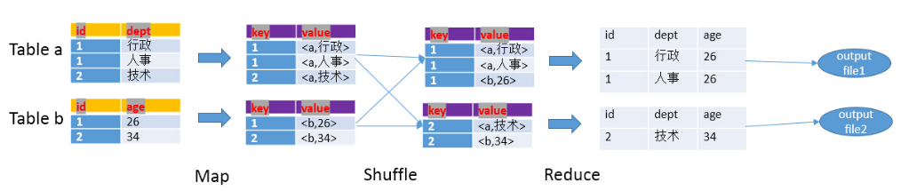
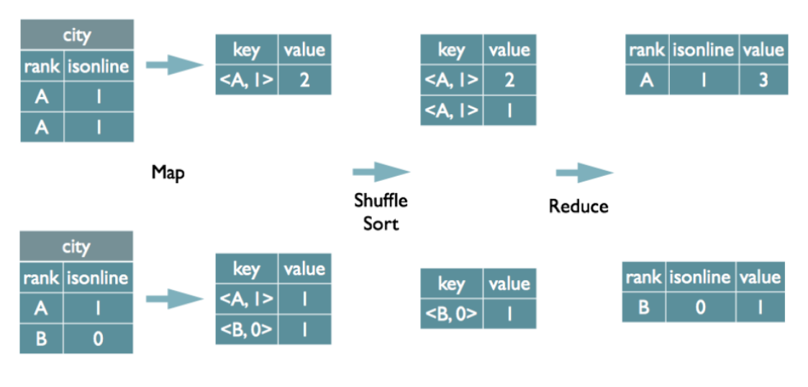
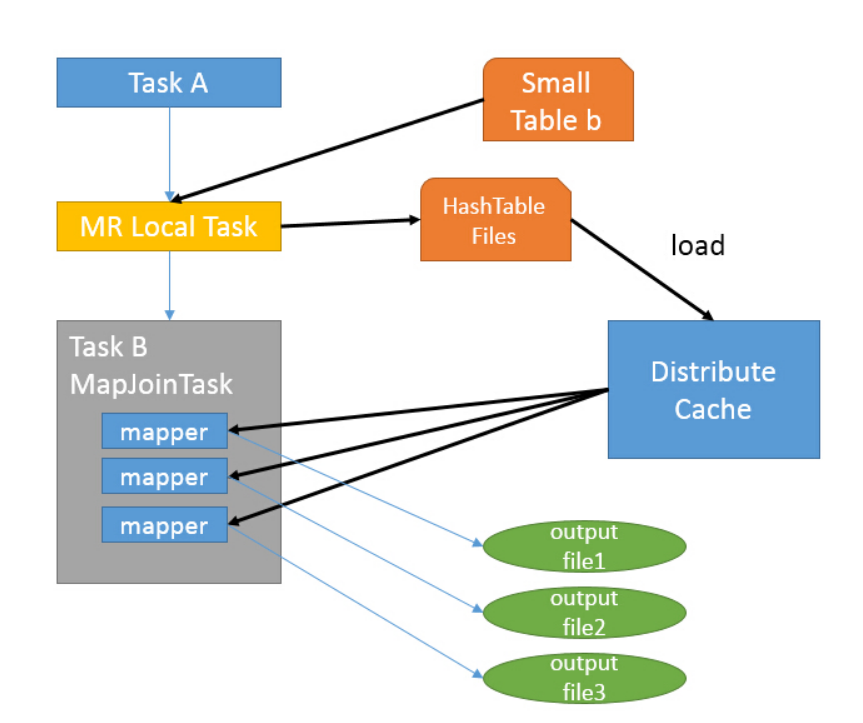

[toc]

# 一、各种不同的JOIN
JOIN | 说明
---|---
JOIN ON  | 内连接
LEFT [OUTER] JOIN ON | 左连接
RIGHT [OUTER] JOIN ON | 右连接
FULL [OUTER] JOIN ON | 全连接
CROSS JOIN | 交叉连接
LEFT SEMI JOIN ON | 左主表连接

```
CREATE TABLE IF NOT EXISTS 0_a (
	id string,
	name string
); 

CREATE TABLE IF NOT EXISTS 0_b (
	id string,
	age INT
);

-----------------------------------
--- 插入数据
-----------------------------------
INSERT INTO 0_a VALUES ('1', 'zhangsan');
INSERT INTO 0_a VALUES ('2', 'lisi');
INSERT INTO 0_a VALUES ('3', 'wangwu');
INSERT INTO 0_b VALUES ('1', 23);
INSERT INTO 0_b VALUES ('2', 24);
INSERT INTO 0_b VALUES ('4', 25);

SELECT * FROM 0_a;
SELECT * FROM 0_b;
```

## JOIN ON  
内连接，ON后面只能做等值匹配
```
SELECT
	*
FROM
	0_a
JOIN
	0_b
ON
	0_a.id = 0_b.id
```
运行结果
0_a.id | 0_a.name | 0_b.id | 0_b.age
---|---|---|---
1 | zhangsan | 1 | 23
2 | lisi | 2 | 24

## LEFT [OUTER] JOIN ON  
左外连接，关键字OUTER可以不写
```
SELECT
	*
FROM
	0_a
LEFT JOIN
	0_b
ON
	0_a.id = 0_b.id
```
运行结果
0_a.id | 0_a.name | 0_b.id | 0_b.age
---|---|---|---
1 | zhangsan | 1 | 23
2 | lisi | 2 | 24
3 | wangwu | NULL | NULL

## RIGHT [OUTER] JOIN ON  
右外连接，关键字OUTER可以不写
```
SELECT
	*
FROM
	0_a
RIGHT JOIN
	0_b
ON
    0_a.id = 0_b.id
```
运行结果
0_a.id | 0_a.name | 0_b.id | 0_b.age
---|---|---|---
1 | zhangsan | 1 | 23
2 | lisi | 2 | 24
NULL | NULL | 4 | 25

## FULL [OUTER] JOIN ON  
全关联，简单的可以理解为LEFT JOIN + RIGHT JOIN，销重后的结果  
全关联不会使用MAPJOIN优化
```
SELECT
	*
FROM
	0_a
FULL JOIN
	0_b
ON
	0_a.id = 0_b.id
```
运行结果
0_a.id | 0_a.name | 0_b.id | 0_b.age
---|---|---|---
1 | zhangsan | 1 | 23
2 | lisi | 2 | 24
3 | wangwu | NULL | NULL
NULL | NULL | 4 | 25

## CROSS JOIN  
笛卡尔乘积 n(左表的记录) * m(右表的记录) = N*M条记录数
```
SELECT
	*
FROM
	0_a
CROSS JOIN
	0_b
```
运行结果
0_a.id | 0_a.name | 0_b.id | 0_b.age
---|---|---|---
1 | zhangsan | 1 | 23
1 | zhangsan | 2 | 24
1 | zhangsan | 4 | 25
2 | lisi | 1 | 23
2 | lisi | 2 | 24
2 | lisi | 4 | 25
3 | wangwu | 1 | 23
3 | wangwu | 2 | 24
3 | wangwu | 4 | 25

## LEFT SEMI JOIN ON  
左主表连接，只能查出左表的字段
```
SELECT
	*
FROM
	0_a
LEFT SEMI JOIN
	0_b
ON
	0_a.id = 0_b.id
```
运行结果
0_a.id | 0_a.name
---|---
1 | zhangsan
2 | lisi

```
--等价于
SELECT 
	a.id,
	a.name 
FROM 
	0_a a 
WHERE 
	a.id IN (SELECT id FROM 0_b);
 
--也等价于
SELECT 
	a.id,
	a.name 
FROM 
	0_a a 
join 
	0_b b 
ON 
	a.id = b.id;
 
--也等价于：
SELECT 
	a.id,
	a.name 
FROM 
	0_a a 
WHERE 
EXISTS (SELECT 1 FROM 0_b b WHERE a.id = b.id);
```

# 二、JOIN解析成MR任务
JOIN分成REDUCE JOIN 和 MAP JOIN
## REDUCE JOIN
reduce join 又可以称为common join、shuffle join、join  
join的执行过程可以分为map、shuffle、reduce三个阶段  

```
SELECT 
    a.id,a.dept,b.age 
FROM a JOIN b 
ON (a.id = b.id);
```




- map 阶段
1. 读取源数据表数据
2. 解析成<key. value>结构，key是where条件字段，value是表名tag+select需要查询出的字段内容
3. 根据key排序

- shuffle 阶段
1. 根据key进行hash，根据hash值分配到不同的reduce节点

- reduce 阶段
1. 根据key进行join操作


## MAP JOIN
map join的执行流程中已经不再具有reduce阶段，和shuffle阶段，直接从map端输出结果


1. 在客户端本地执行Task A，读取小表b的数据，将其转换成hash的<key， value>结构
2. 在客户端生成一个本地文件HashTableFile
3. 将文件加载到DistributeCache中
4. 启动mapTask扫描大表数据，每一条记录根据内存中缓存的b表数据计算，处理并输出结果

> MAP JOIN带来的优势
- 小表连接大表，缩短运行时间
- 需要在join中使用不等式条件的时候，可以将on改为where，where就是在map阶段执行的

## SMB(Sort-Merge-Buket) Join
适用于大表和大表做join，详见参考文章《Hive Sort Merge Bucket Map Join》

# 大牛博文章参考
[Hive中Join的类型和用法](http://lxw1234.com/archives/2015/06/315.htm)  
[Hive中Join的原理和机制](http://lxw1234.com/archives/2015/06/313.htm)  
[Hive的三种Join方式](https://www.cnblogs.com/raymoc/p/5323824.html)  
[hive优化之——控制hive任务中的map数和reduce数](http://lxw1234.com/archives/2015/04/15.htm)  
[Hive Sort Merge Bucket Map Join](http://blog.csdn.net/lzm1340458776/article/details/43274505)  
[Hive JOIN使用详解](http://shiyanjun.cn/archives/588.html)  


> @ WHAT - HOW - WHY  
> @ 不积跬步 - 无以至千里  
> @ 学必求其心得 - 业必贵其专精