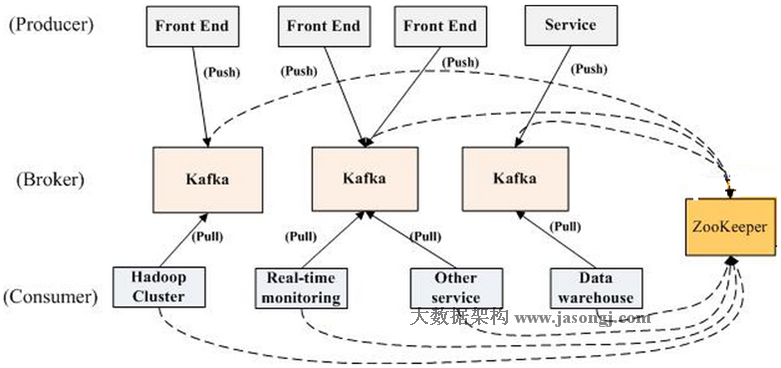
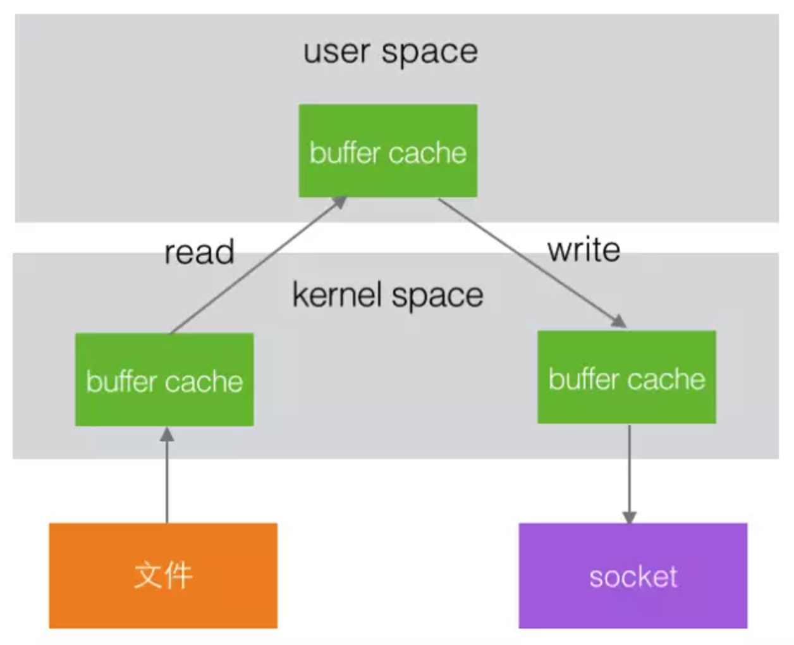
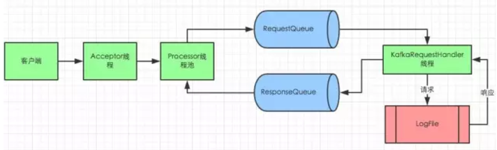

# Kafka Quick Start

### 一、官方文档


特性介绍 [Introduction](https://kafka.apache.org/intro)  
安装上手 [Quickstart](https://kafka.apache.org/quickstart)  

```
> tar -xzf kafka_2.11-0.10.0.0.tgz  
> cd kafka_2.11-0.10.0.0  
> bin/zookeeper-server-start.sh config/zookeeper.properties  
> bin/kafka-server-start.sh config/server.properties  
> bin/kafka-topics.sh --create --zookeeper localhost:2181 --replication-factor 1 --partitions 1 --topic test  
> bin/kafka-topics.sh --list --zookeeper localhost:2181  

> bin/kafka-console-producer.sh --broker-list localhost:9092 --topic test  
> bin/kafka-console-consumer.sh --zookeeper localhost:2181 --topic test --from-beginning  
> bin/kafka-topics.sh --describe --zookeeper localhost:2181 --topic test
```

### 二、关键词定义&结构
| 名词           | 定义                                           |
| -------------- | ---------------------------------------------- |
| producer       | 生产者                                         |
| consumer       | 消费者                                         |
| consumer group | 消费者组                                       |
| broker         | 集群中的单个实例                               |
| topic          | 一类信息，会分成多个partition(区)              |
| partition      | 在存储层面是append log文件                     |
| offset         | 一个long型数字，唯一标记一条消息               |
| log生命周期    | 消费后不会立即删除消息，设定固定的消息删除时间 |


### 1、partition
每个partition有两个角色，leader和follower，leader负责所有的读写请求，follower负责容灾，当leader 出现问题时，优先从ISR列表中选出一个新的leader

### 2、consumer
Kafka提供了两套consumer api，分为high-level api和sample-api。    
Sample-api 是一个底层的API，它维持了一个和单一broker的连接，并且这个API是完全无状态的，每次请求都需要指定offset值，同一个group也可以多次消费相同的数据。  
Consumer high level API时，同一Topic的一条消息只能被同一个Consumer Group内的一个Consumer消费，但多个Consumer Group可同时消费这一消息。

### 3、清理数据
一是基于时间，二是基于Partition文件大小
```
# The minimum age of a log file to be eligible for deletion
log.retention.hours=168

# A size-based retention policy for logs. Segments are pruned from the log as long as the remaining
# segments don't drop below log.retention.bytes.
#log.retention.bytes=1073741824

# The maximum size of a log segment file. When this size is reached a new log segment will be created.
log.segment.bytes=1073741824
```

### 4、delivery guarantee —— At least one
At most once 消息可能会丢，但绝不会重复传输  
At least one 消息绝不会丢，但可能会重复传输  
Exactly once 每条消息肯定会被传输一次且仅传输一次，很多时候这是用户所想要的  

## 三、kafka数据写入和检索
### 1、数据存储结构
- topic -> partition -> segment -> .index | .log -> offset  

- partition是一个目录名称，命名规则 —— topic加序号  

- 每一条消息都有一个key —— 也就是offset，key可以作为分partition的依据

- 每一个segment里面包含了两个文件 —— 索引文件、数据文件  ，segment文件以offset区间的起始值命名，长度固定20位，不足的位用0填充
  例如存储了第0-20条的消息，segment文件就是：  
  00000000000000000000.index  
  00000000000000000000.log  

- index文件结构很简单，每一行都是一个key,value对
  key 是消息的序号offset  
  value 是消息的物理位置偏移量  
  如
  1,0  
  3,299  
  6,497  
  ...

- log文件中保存了消息的实际内容，和相关信息
  如消息的offset、消息的大小、消息校验码、消息数据等
  
### 2、根据offset检索数据流程
offset -> find segment -> look for index find 物理位置偏移量 -> read data from log file


## 四、Kafka实现高吞吐量
Kafka将所有的消息都写入磁盘存储，更加稳定、容量更大，更容易扩容。下面从几个方面解析kafka高吞吐量的原因
### 1、磁盘顺序读写
kafka的消息是最佳的方式写入的，这使得Kafka可以充分利用磁盘的顺序读写性能。顺序读写不需要硬盘磁头的寻道时间，只需很少的扇区旋转时间，所以速度远快于随机读写。  
Kafka官方给出了测试数据(Raid-5，7200rpm)：  
顺序 I/O: 600MB/s  
随机 I/O: 100KB/s


### 2、零拷贝

升级为

在Linux kernel2.2 之后出现了一种叫做"零拷贝(zero-copy)"系统调用机制，就是跳过“用户缓冲区”的拷贝，建立一个磁盘空间和内存的直接映射，数据不再复制到“用户态缓冲区”。系统上下文切换减少为2次，可以提升一倍的性能

### 3、文件分区
kafka的每个topi分成很多个partition，每个partition分为多个段segment，通过分片、分段的形式增加了并行度

### 4、batch机制
kafka除了可以单条数据处理，还可以批处理，减少服务端的I/O次数

### 5、数据压缩
Producer可以通过GZIP或Snappy格式对消息集合进行压缩，Consumer进行解压。压缩的好处就是减少传输的数据量，减轻对网络传输的压力。虽然增加了CPU的工作，但在对大数据处理上，瓶颈在网络上而不是CPU，所以这个成本很值得

## 五、Kafka高可用设计（HA）
Kafka从0.8开始支持Partition的Replication，Kafka数据的读写只和Leader交互，其他follower从leader复制消息。  
### 1、半同步、半异步
Kafka维护了一个ISR列表，在列表里的followers是完全同步（每次数据写入的时候必须所有的followers复制完成才返回成功），不在ISR列表内的followers是完全异步处理（只要leader写入成功就返回结束）


### 2、容灾
当leader挂掉，优先从ISR列表中选取leader。  
如果ISR列表中副本也都挂掉了，从剩下的follower种选一个作为leader，这时候不能确定数据同步是否执行完毕，所以会存在数据丢失的风险  
如果所有的副本都挂掉了，优先等待ISR副本恢复（最稳） 或者 只要有副本恢复就选举为leader（最快）可以通过配置文件配置

## 五、Kafka通讯

这个图采用的是[SEDA多线程模型](http://www.jianshu.com/p/e184fdc0ade4)  
1、对于broker来说，客户端连接数量有限，不会频繁新建大量连接。因此一个Acceptor thread线程处理新建连接绰绰有余    
2、Kafka高吐吞量，则要求broker接收和发送数据必须快速，因此用proccssor   thread线程池处理，并把读取客户端数据转交给缓冲区，不会导致客户端请求大量堆积  
3、Kafka磁盘操作比较频繁会且有io阻塞或等待，IO Thread线程数量一般设置为proccssor thread num两倍，可以根据运行环境需要进行调节

## 问题
### 1、kafka如何选举leader
### 2、同一个consumer group可能消费到重复的数据么
​	consumer自己记录自当前消费的每个partition的offset，partition是分配给每个group内消费者的最小单元，所以同一个Group内的消费者共同消费一个topic，不会有数据重复

> 参考文章  
> [kafka官网](https://kafka.apache.org/)   
> [Spark 实战, 第 2 部分:使用 Kafka 和 Spark Streaming 构建实时数据处理系统](https://www.ibm.com/developerworks/cn/opensource/os-cn-spark-practice2)  
> [Kafka是如何实现高吞吐率的](https://mp.weixin.qq.com/s/vf4su_rl-UOGS8vHTCeDrg)  
> [Kafka 高可用设计](https://mp.weixin.qq.com/s?__biz=MzA4Nzc4MjI4MQ==&mid=403010532&idx=1&sn=488abde3a64cb6dd3ab7614a246dad1c&scene=21#wechat_redirect)  
> [Kafka 消息存储及检索](https://mp.weixin.qq.com/s?__biz=MzA4Nzc4MjI4MQ==&mid=403030511&idx=1&sn=f66eac3cd3af5f5c57d2e8433a1c9856&scene=21#wechat_redirect)   
> [跟我学Kafka之NIO通信机制](https://mp.weixin.qq.com/s/Qs3Kjp0FLiLTuyNgZsooMg)

> @ WHAT - HOW - WHY  
> @ 不积跬步 - 无以至千里  
> @ 学必求其心得 - 业必贵其专精