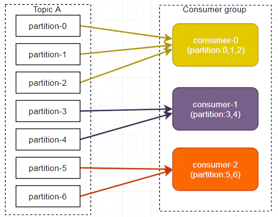

[toc]

## 一、Kafka结构


名词 | 定义
---|---
producer | 生产者
consumer | 消费者
consumer Group | 消费者组，每个消费者负责N个分区，每个分区只对应组内一个消费者，保证数据消费的并发与唯一
broker   | 集群中的单个实例
topic    | 逻辑主题，由多个partition(区)组成
partition| 物理层主题，有序的写入文件数据
Replica | 副本，partition的角色可以分为leader和follower，replica存在follower中
Leader | 主副本存在的partition
Follower | 副本存在的partition
ISR | in-sync replica set，零延迟的Follower组成的动态集合
offset   | 一个long型数字，唯一标记一条消息
log生命周期 | 消费后不会立即删除消息，设定固定的消息删除时间

### 1、partition
每个partition有两个角色，leader和follower，leader负责所有的读写请求，follower负责容灾，当leader 出现问题时，优先从ISR列表中选出一个新的leader

### 2、consumer
Kafka提供了两套consumer api，分为high-level api和sample-api。    
Sample-api 是一个底层的API，它维持了一个和单一broker的连接，并且这个API是完全无状态的，每次请求都需要指定offset值，同一个group也可以多次消费相同的数据。  
Consumer high level API时，同一Topic的一条消息只能被同一个Consumer Group内的一个Consumer消费，但多个Consumer Group可同时消费这一消息。

### 3、清理数据
一是基于时间，二是基于Partition文件大小
```
# The minimum age of a log file to be eligible for deletion
log.retention.hours=168

# A size-based retention policy for logs. Segments are pruned from the log as long as the remaining
# segments don't drop below log.retention.bytes.
#log.retention.bytes=1073741824

# The maximum size of a log segment file. When this size is reached a new log segment will be created.
log.segment.bytes=1073741824
```

## 二、kafka数据product
### 1、数据存储结构


- partition是一个目录名称，命名规则 —— topic加序号  
- topic -> partition -> segment -> .index | .log -> offset  


- 每一条消息都有一个key —— 也就是offset，key可以作为分partition的依据
- 每一个segment里面包含了两个文件 —— 索引文件、数据文件  ，segment文件以offset区间的起始值命名，长度固定20位，不足的位用0填充
例如存储了第0-20条的消息，segment文件就是：  
00000000000000000000.index  
00000000000000000000.log  
- index文件结构很简单，每一行都是一个key,value对
key 是消息的序号offset  
value 是消息的物理位置偏移量  
如
1,0  
3,299  
6,497  
...
- log文件中保存了消息的实际内容，和相关信息
如消息的offset、消息的大小、消息校验码、消息数据等

### 2、Topic分区策略
- 分区原因  
topic有多个partition，可以提高并发；partition 可以通过调整更好的适应机器存储块
- 分区原则  
我们需要将Producer发送的数据封装成一个ProducerRecord 对象。该对象需要指定一些参数：  
topic：string 类型，NotNull  
partition：int 类型，可选  
timestamp：long 类型，可选  
key：string类型，可选  
value：string 类型，可选  
headers：array 类型，Nullable  
1）value不为空，value值为partition个数  
2）value为空，key不为空，将key的hash值与分区数取余得到partition值  
3）啥都没有，第一次调用时随机生成一个整数（后面每次调用都在这个整数上自增），将这个值与可用的分区数取余，得到 partition 值，也就是常说的round-robin轮询算法。

### 3、数据写入容灾，保证数据可靠性
#### 1）ACK机制
  
为保证数据能可靠地发送到指定的topic，每个partition收到producer 发送的数据后，都需要向producer发送ack（acknowledge确认收到），如果 producer收到ack，就会进行下一轮的发送，否则重新发送数据  
ack值的设置
- 0，【At most once】producer不需要等待broker的ack返回，broker收到数据即可
- 1，producer等待leader写入成功后的broker返回ack，如果follower在同步成功前leader故障，则数据丢失
- -1，【At least one】producer等待所有的leader、follower写完后的broker返回ack，如果同步过程中leader故障，选取出来的新leader已经复制数据成功，则会发生数据重复情况


#### 2）ISR机制
leader维护了一个动态的in-sync replica set（ISR,和leader保持同步的 follower集合)    
当ISR集合中的follower完成数据的同步之后，leader就会给follower发送 ack。如果follower长时间未向leader同步数据，则该follower将被踢出ISR集合，该时间阈值由replica.lag.time.max.ms参数设定  
leader发生故障后，就会从ISR中选举出新的leader


#### 3）故障处理机制


**LEO：局部的，每个副本最大的 offset**  
**HW：全局的，消费者能见到的最大的offset，ISR队列中最小的LEO**  
（1）Leader 故障  
leader发生故障后 —— 从ISR中选新的 leader —— 为保证多个副本之间的数据一致性，其余的follower会先将各自的log 文件高于HW的部分截掉 —— 从新的leader同步数据 

（2）ISR-Follower 故障  
follower发生故障 —— 临时踢出ISR集合 —— follower恢复 —— 读取本地磁盘上次的HW —— 将log文件高于HW的部分截取掉 —— 从旧HW开始向 leader进行同步数据操作 —— 等该follower的LEO大于等于该partition的全局最新HW —— 重新加入ISR    

**注意：这只能保证副本之间的数据一致性，并不能保证数据不丢失或者不重复**

#### 4）Exactly once语义
At Least Once 可以保证数据不丢失，但是不能保证数据不重复；  
At Most Once 可以保证数据不重复，但是不能保证数据不丢失。  
但是，对于一些非常重要的信息，需要Exactly Once， 比如交易数据，既不重复也不丢失。  
0.11版本的Kafka，引入了幂等性：producer不论向 server 发送多少重复数据，server端都只会持久化一条。即：
At Least Once + 幂等性 = Exactly Once   
要启用幂等性，只需要将producer的参数中enable.idompotence设置为true即可。  
开启幂等性的producer在初始化时会被分配一个PID，发往同一partition 的消息会附带Sequence Number。而borker端会对 <PID,Partition,SeqNumber> 做缓存，当具有相同主键的消息提交时，broker只会持久化一条。  
但是 PID 重启后就会变化，同时不同的 partition 也具有不同主键，所以幂等性无法保证跨分区会话的 Exactly Once。

## 三、kafka数据consumer
### 1、分区分配给consumer的策略
一个consumer group中有多个consumer，  
一个topic中有多个partition，  
一个consumer可以消费多个topic  
but，一个partition只能对应一个consumer  
kafka有两种分配策略，默认是range  
- 1）轮询RoundRobin  
将所有的topic的partition就行hash排序，放一列，  
所有的同group下的consumer放一列，  
从第一个partition开始将所有的partition按顺序的循环的分配给所有的consumer  

优点：多个consumer负载均衡，负责的partition各种最多相差1个  
缺点：同group不区分partition是属于哪个topic的，consumer1订阅topic1，consumer1订阅topic2的时候，会出现topic1、topic2的数据在consumer1、consumer2混合交叉出现的现象  


- 2）Range  

考虑了topic，对于同一个topic的partition，大家一起来均分  
优点：解决没有订阅交叉读取的现象  
缺点：可能会有负载不均衡  
  
当consumer-0、consumer-1同时订阅了topic-A、topic-B的时候，  
对于topic-A， 3=2+1，consumer-0得2
对于topic-B， 3=2+1，consumer-0得2  
最后消费者组内订阅的主题越多，分区分配越不均衡

### 2、根据offset检索数据流程
offset -> find segment -> look for index find 物理位置偏移量 -> read data from log file  
Kafka 0.9版本之前，consumer默认将offset保存在Zookeeper中，  
从0.9版本开始，consumer默认将offset保存在Kafka一个内置的topic中，该 topic为 __consumer_offsets

## 四、Kafka实现高吞吐量
Kafka将所有的消息都写入磁盘存储，更加稳定、容量更大，更容易扩容。下面从几个方面解析kafka高吞吐量的原因
### 1、磁盘顺序读写
kafka的消息是最佳的方式写入的，这使得Kafka可以充分利用磁盘的顺序读写性能。顺序读写不需要硬盘磁头的寻道时间，只需很少的扇区旋转时间，所以速度远快于随机读写。  
Kafka官方给出了测试数据(Raid-5，7200rpm)：  
顺序 I/O: 600MB/s  
随机 I/O: 100KB/s


### 2、零拷贝

升级为

在Linux kernel2.2 之后出现了一种叫做"零拷贝(zero-copy)"系统调用机制，就是跳过“用户缓冲区”的拷贝，建立一个磁盘空间和内存的直接映射，数据不再复制到“用户态缓冲区”。系统上下文切换减少为2次，可以提升一倍的性能

### 3、文件分区
kafka的每个topi分成很多个partition，每个partition分为多个段segment，通过分片、分段的形式增加了并行度

### 4、batch机制
kafka除了可以单条数据处理，还可以批处理，减少服务端的I/O次数

### 5、数据压缩
Producer可以通过GZIP或Snappy格式对消息集合进行压缩，Consumer进行解压。压缩的好处就是减少传输的数据量，减轻对网络传输的压力。虽然增加了CPU的工作，但在对大数据处理上，瓶颈在网络上而不是CPU，所以这个成本很值得

## 五、Kafka通讯

这个图采用的是[SEDA多线程模型](http://www.jianshu.com/p/e184fdc0ade4)  
1、对于broker来说，客户端连接数量有限，不会频繁新建大量连接。因此一个Acceptor thread线程处理新建连接绰绰有余    
2、Kafka高吐吞量，则要求broker接收和发送数据必须快速，因此用proccssor   thread线程池处理，并把读取客户端数据转交给缓冲区，不会导致客户端请求大量堆积  
3、Kafka磁盘操作比较频繁会且有io阻塞或等待，IO Thread线程数量一般设置为proccssor thread num两倍，可以根据运行环境需要进行调节

## 重点关注
### 1、kafka如何选举leader
### 2、kafka每一个partition如何保证每次只被一个consumer group消费
### 3、同一个consumer group可能消费到重复的数据么

> 参考文章  

[kafka官网](https://kafka.apache.org/)   
[Kafka是如何实现高吞吐率的](https://mp.weixin.qq.com/s/vf4su_rl-UOGS8vHTCeDrg)    
[Kafka 高可用设计](https://mp.weixin.qq.com/s?__biz=MzA4Nzc4MjI4MQ==&mid=403010532&idx=1&sn=488abde3a64cb6dd3ab7614a246dad1c&scene=21#wechat_redirect)  
[Kafka 消息存储及检索](https://mp.weixin.qq.com/s?__biz=MzA4Nzc4MjI4MQ==&mid=403030511&idx=1&sn=f66eac3cd3af5f5c57d2e8433a1c9856&scene=21#wechat_redirect)   
[跟我学Kafka之NIO通信机制](https://mp.weixin.qq.com/s/Qs3Kjp0FLiLTuyNgZsooMg)  
[Kafka架构原理*](https://juejin.im/post/5e217c3fe51d450200787f23)  
[这些经典的kafka知识*](https://juejin.im/post/5ee64e3df265da77135a2462)  

> @ WHAT - HOW - WHY  
> @ 不积跬步 - 无以至千里  
> @ 学必求其心得 - 业必贵其专精