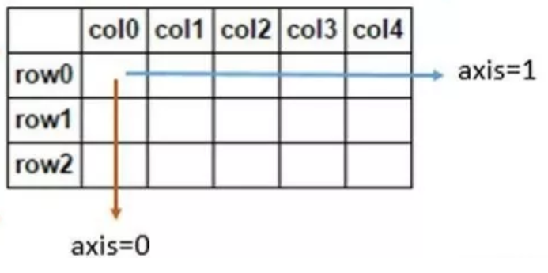

[toc]

# 一、创建DF




``` python
# 读取文件
df = pd.read_csv("data/titanic.csv")
```

``` python
# 从字典中来
d = {'col1': [1, 2], 'col2': [3, 4]}
df = pd.DataFrame(data=d)
df
   col1  col2
0     1     3
1     2     4
```

``` python
# 从数组中来
df2 = pd.DataFrame(np.array([[1, 2, 3], [4, 5, 6], [7, 8, 9]]),
                   columns=['a', 'b', 'c'])
df2
   a  b  c
0  1  2  3
1  4  5  6
2  7  8  9
```


# 二、查询


## 2.1 基本信息

### head
``` python
data.head()
company  salary  age
0     NaN      43   21
1       A       8   41
2       A      28   26

# 查看前5行
df.head()

# 查看前10行
df.head(10)

# 查看第一行
df[0:1]

# 查看 10到20行
df[10:21]

# 查看看Date列前5个数据
df["date"].head() 

df.date.head()

df[["date","code", "open"]].head()
```

### tail
``` python
# 查看后5行
df.tail()
```

### info 特征属性
``` python
data.info()
<class 'pandas.core.frame.DataFrame'>
RangeIndex: 9 entries, 0 to 8
Data columns (total 3 columns):
company    8 non-null object
salary     9 non-null int32
age        9 non-null int32
dtypes: int32(2), object(1)
memory usage: 224.0+ bytes
```

### dtypes 列的数据类型
``` python
df.dtypes
date       object
open        float64
close        float64
high         float64
low          float64
volume    float64
code       object
dtype: object
```

### isna 每个字段是否是NULL
``` python
In [22]: data.isna()
Out[22]:
   company  salary    age
0     True   False  False
1    False   False  False
2    False   False  False
```

### isin
``` python
# 筛选出A公司和C公司的员工记录
In [29]: data.loc[data['company'].isin(['A','C'])]
Out[29]:
   number company  gender  salary
1      31       A  female      36
5      22       A    male      46
8      32       C    male      19
```

### any 判断某一列是不是有True
``` python
In [23]: data.isna().any()
Out[23]:
company     True
salary     False
age        False
dtype: bool
```


## 2.2 统计信息

### describe 统计信息
``` python
# 默认生成数值列的描述性统计
# 使用 include = 'all'生成所有列
In [18]: data.describe()
Out[18]:
          salary        age
count   9.000000   9.000000
mean   31.777778  27.111111
std    12.804079   9.143911
min     8.000000  18.000000
25%    25.000000  21.000000
50%    33.000000  26.000000
75%    42.000000  28.000000
max    48.000000  43.000000
```

### 统计函数mean、quantile

``` python
# 单独统计Open列的平均值
df.Open.mean()

# 查看居于95%的值, 默认线性拟合
df.Open.quantile(0.95)
```

### value_count

``` python
In [19]: data['company'].value_counts()
Out[19]:
A    4
B    2
C    2
Name: company, dtype: int64
        
# 返回占比情况
In [20]: data['company'].value_counts(normalize=True)
Out[20]:
A    0.50
B    0.25
C    0.25
Name: company, dtype: float64

# 升序排列
In [21]: data['company'].value_counts(ascending=True)
Out[21]:
C    2
B    2
A    4
Name: company, dtype: int64
```


## 2.3 检索

### loc 按照索引、列名选取

``` python
# 查看date, code列的第10行
df.loc[10, ["date", "code"]]

# 查看date, code列的第10行到20行
df.loc[10:20, ["date", "code"]]

# 查看第一行,open列的数据
df.loc[0, "open"]
```

### iloc 按照行、列号选取
```python
# 查看第1行()
df.iloc[0]

# 查看最后一行
df.iloc[-1]

# 查看第一列，前5个数值
df.iloc[:,0].head()

# 查看前2到4行，第1，3列
df.iloc[2:4,[0,2]]
```

### 条件过滤查询

```python
# 查看open列大于10的前5行
df[df.open > 10].head()

# 查看open列大于10且open列小于10.6的前五行
df[(df.open > 10) & (df.open < 10.6)].head()

# 查看open列大于10或open列小于10.6的前五行
df[(df.open > 10) | (df.open < 10.6)].head()
```


## 2.4 排序，默认不修改源数据

### sort_index

- ascending （boolean, default True）  
是否升序排列
- inplace （boolean, default False）  
是否作用于原对象
``` python
# 按索引降序排列
In [27]: data.sort_index(ascending=False)
Out[27]:
  company  salary  age
8       B      39   18
7       B      25   23
6       A      48   43
```

### sort_values

参数：
- by （str or list of str）  
作用于DataFrame时需要指定排序的列
- ascending （boolean, default False）  
是否升序排列
``` python
In [28]: data.sort_values(by='salary')
Out[28]:
  company  salary  age
1       A       8   41
5       C      20   18
7       B      25   23
2       A      28   26
4       A      33   26
```


## 2.5 分组

### groupby

``` python
data.groupby("company").agg('mean')

# 常用的函数，min, max, sum, mean, median, std, var, count
data.groupby('company').agg({'salary':'median','age':'mean'})
```

### groupby + transform，生成新列

``` python
In [24]: data['avg_salary'] = data.groupby('company')['salary'].transform('mean')

In [25]: data
Out[25]:
  company  salary  age  avg_salary
0       C      43   35       29.25
1       C      17   25       29.25
```

### groupby + apply 自定义分组的处理函数

```python
# 获取各个公司年龄最大的员工的数据
def get_oldest_staff(x):
    df = x.sort_values(by = 'age',ascending=True)
    return df.iloc[-1,:]

In [39]: oldest_staff = data.groupby('company',as_index=False).apply(get_oldest_staff)

In [40]: oldest_staff
Out[40]:
  company  salary  age  
0       A      23   33       
1       B      21   40       
2       C      43   35  
```


# 三、修改


## 3.1 修改数据

### map (series粒度)

把数据集中gender列的男替换为1，女替换为0
``` python
# 使用字典进行映射
data["gender"] = data["gender"].map({"男":1, "女":0})

# 使用函数
def gender_map(x):
    gender = 1 if x == "男" else 0
    return gender

data["gender"] = data["gender"].map(gender_map)
```

### apply (行、列粒度)

不直接修改源数据，假设在数据统计的过程中，年龄age列有较大误差，需要对其进行加上或减去一个值

``` python
def apply_age(x,bias):
    return x+bias

#以元组的方式传入额外的参数
data["age"] = data["age"].apply(apply_age, args=(-3,))
```
axis=0代表操作对列columns进行  
axis=1代表操作对行row进行  
不同的算子计算方式不同，sum会全部求和，log会单个单个取log
``` python
# 沿着0轴，列求和
data[["height","weight","age"]].apply(np.sum, axis=0)

# 沿着0轴，列轴取对数
data[["height","weight","age"]].apply(np.log, axis=0)
```
计算每个人的BMI
``` python
def BMI(series):
    weight = series["weight"]
    height = series["height"]/100
    BMI = weight/height**2
    return BMI

data["BMI"] = data.apply(BMI, axis=1)
```

lambda的用法  
``` python
# 将Open列每个数值加1, apply方法并不直接修改源数据，所以需要将新值复制给df
df.Open = df.Open.apply(lambda x: x+1)

# 将Open，Close列都数值上加1,如果多列，apply接收的对象是整个列
df[["Open", "Close"]].head().apply(lambda x: x.apply(lambda x: x+1))
```

### applymap (元素粒度)

DataFrame中所有的值保留两位小数显示
```
df.applymap(lambda x:"%.2f" % x)
```

### fillna

- value （scalar, dict, Series, or DataFrame）  
用于填充缺失值的值  
- method （{‘backfill’, ‘bfill’, ‘pad’, ‘ffill’, None}, default None）  
缺失值的填充方式，常用的是bfill后面的值进行填充，ffill用前面的值进行填充  
- inplace （boolean, default False）  
是否作用于原对象
``` python
In [26]: data.fillna('B')
Out[26]:
  company  salary  age
0       B      43   21
1       A       8   41

# 用缺失值后面的值来填充（这里NaN后面是'A'）
In [25]: data.fillna(method='bfill')
Out[25]:
  company  salary  age
0       A      43   21
1       A       8   41
```

### where 条件判断赋值
``` python
# 若salary<=40，则保持原来的值不变
# 若salary大于40，则设置为40
In [38]: data['salary'].where(data.salary<=40, 40)
Out[38]:
0    30
1    36
2    35
```

### concat 拼接df
``` python
In [45]: pd.concat([data1,data2],ignore_index = False)
Out[45]:
   number company  gender  salary
0      40       B  female      30
1      31       A  female      36
2      28       B  female      35
6      28       B  female      15
7      40       B  female      33
8      32       C    male      19

# 拼接数据并重置索引
In [46]: pd.concat([data1,data2],ignore_index=True)
Out[46]:
   number company  gender  salary
0      40       B  female      30
1      31       A  female      36
2      28       B  female      35
3      28       B  female      15
4      40       B  female      33
5      32       C    male      19
```

``` python
# 按照行列拼装
# 分别取0到2行，2到4行，4到9行组成一个列表，通过concat方法按照axis=0，行方向合并, axis参数不指定，默认为0
split_rows = [df.iloc[0:2,:], df.iloc[2:4,:], df.iloc[4:9]]
pd.concat(split_rows)

# 分别取2到3列，3到5列，5列及以后列数组成一个列表，通过concat方法按照axis=1，列方向合并
split_columns = [df.iloc[:,1:2], df.iloc[:,2:4], df.iloc[:,4:]]
pd.concat(split_columns, axis=1).head()
```

### append

``` python
# 将第一行追加到最后一行
df.append(df.iloc[0,:], ignore_index=True).tail()
```


## 3.2 修改属性

### astype 修改数据类型

``` python
In [12]: data["age"] = data["age"].astype(int)
```

### rename 修改列名

``` python
将'age'更改为员工编号'number',并作用于原对象
In [15]: data.rename(columns={'age':'number'},inplace=True)

In [16]: data
Out[16]:
  company  gender  salary  number
0       B  female      30      40
1       A  female      36      31

# 直接修改列的字段
df.columns = ["Date", "Open","Close","High","Low","Volume","Code"]
```

### set_index 选一列、多列作为索引

``` python
In [19]: data.set_index('number',inplace=True)

In [20]: data
Out[20]:
       company  gender  salary
number
40           B  female      30
31           A  female      36
```


# 四、删除

### dropna空数据的行

``` python
In [24]: data.dropna()
Out[24]:
  company  salary  age
1       A       8   41
2       A      28   26
3       C      42   28
```

### drop

``` python
# 删掉'gender'列
In [27]: data.drop(columns = ['gender'])
Out[27]:
   number company  salary
0      40       B      30
1      31       A      36
```

### drop_duplicates 去重

``` python
In [26]: data['company'].drop_duplicates()
Out[26]:
0    B
1    A
8    C
Name: company, dtype: object
```


# 五、保存

``` python
# 将df数据保存到当前工作目录的stock.csv文件
df.to_csv("stock.csv")
```


>  参考链接  
> https://zhuanlan.zhihu.com/p/101284491  
> [官网](https://pandas.pydata.org/docs/index.html)  
> [Getting started tutorials](https://pandas.pydata.org/docs/getting_started/intro_tutorials/index.html#getting-started-tutorials)  
> [Comparison with SQL](https://pandas.pydata.org/docs/getting_started/comparison/comparison_with_sql.html)