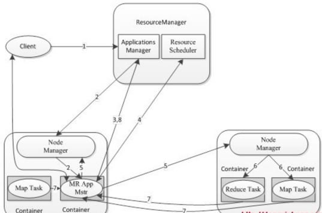
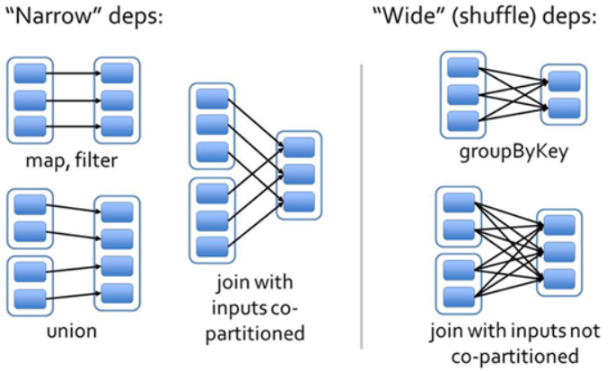

[toc]

# 一、Application 【重点，stage划分策略】

## 1.1 任务提交 - spark conf


① 构建Application的运行环境，Driver创建一个SparkContext
② SparkContext向资源管理器（Standalone、Mesos、Yarn）申请Executor资源，资源管理器启动StandaloneExecutorbackend（Executor） 
③ Executor向SparkContext申请Task 
④ SparkContext将应用程序分发给Executor 
⑤ SparkContext就建成DAG图，DAGScheduler将DAG图解析成Stage，每个Stage有多个task，形成taskset发送给task Scheduler，由task Scheduler将Task发送给Executor运行
⑥ Task在Executor上运行，运行完释放所有资源

任务从本地机器执行spark-submit命令将任务提交到集群

- --master yarn | local[*] 指定集群管理器
- --deploy-mode cluster 指定driver节点是本机还是集群上的任意节点

```
val conf = new SparkConf()
val sc = new SparkContext(conf)
```
设置参数的地方有四，优先级从高到低分别是:程序set设定 -> spark summit 提交参数指定 -> 传配置文件设置(--properties-file) -> spark安装目录中设置conf/spark-defaults.conf

## 1.2 任务提交 - DAG
任务首先到driver节点上，driver节点负责任务的划分和调度，executor节点负责任务的执行和必要数据的缓存。程序RDD之间的转化定义了一张DAG有向无环图，driver节点将DAG转换成物理执行过程，划分成job、stage分发到各个executor节点上执行。
- job， 每一个行动操作就是一个job，比如take、first、foreach
- stage，每一个行动操作、每一次触发shuffle都会产生一次新的stage
- task，stage在executor上并行执行，分成的小任务就是task  
- 【重点，stage如何划分】
http://www.cnblogs.com/bonelee/p/6039469.html  
1、当触发rdd的action时: 比如collect，count、take、first、reduce、foreach  
2、当触发rdd的shuffle操作时: 比如repartition、coalesce、ByKey operations (except for counting) like groupByKey and reduceByKey, sortByKey and join operations like cogroup and join.

- Application --> Driver Program --> DAG --> Jobs --> Stages --> Taskset --> TaskScheduler --> Executors --> Tasks

## 1.3 Yarn执行一个任务的过程

​     

​    1）客户端client向ResouceManager提交Application，ResouceManager接受Application并根据集群资源状况选取一个node来启动Application的任务调度器driver（ApplicationMaster）。
  2）ResouceManager找到那个node，命令其该node上的nodeManager来启动一个新的 JVM进程运行程序的driver（ApplicationMaster）部分，driver（ApplicationMaster）启动时会首先向ResourceManager注册，说明由自己来负责当前程序的运行。
  3）driver（ApplicationMaster）开始下载相关jar包等各种资源，基于下载的jar等信息决定向ResourceManager申请具体的资源内容。
  4）ResouceManager接受到driver（ApplicationMaster）提出的申请后，会最大化的满足 资源分配请求，并发送资源的元数据信息给driver（ApplicationMaster）。
  5）driver（ApplicationMaster）收到发过来的资源元数据信息后会根据元数据信息发指令给具体机器上的NodeManager，让其启动具体的container。
  6）NodeManager收到driver发来的指令，启动container，container启动后必须向driver（ApplicationMaster）注册。
  7）driver（ApplicationMaster）收到container的注册，开始进行任务的调度和计算，直到 任务完成。
  注意：如果ResourceManager第一次没有能够满足driver（ApplicationMaster）的资源请求 ，后续发现有空闲的资源，会主动向driver（ApplicationMaster）发送可用资源的元数据信息以提供更多的资源用于当前程序的运行

Driver Program  —— ApplicationMaster

Cluster Manager —— ResouceManager

Worker Node —— NodeManager

Executor —— container

## 1.4 partition划分

```
## step1：读文件
val textFile = sc.textFile("/hhf/LICENSE")

## step2: 创建hadoopFile
def textFile(
  path: String,
  minPartitions: Int = defaultMinPartitions): RDD[String] = withScope {
    assertNotStopped()
    hadoopFile(path, classOf[TextInputFormat],classOf[LongWritable], classOf[Text],minPartitions).map(pair => pair._2.toString)
}
  
## step3: 获得getPartitions，
override def getPartitions: Array[Partition] = {
    val jobConf = getJobConf()
    // add the credentials here as this can be called before SparkContext initialized
    SparkHadoopUtil.get.addCredentials(jobConf)
    val inputFormat = getInputFormat(jobConf)
    if (inputFormat.isInstanceOf[Configurable]) {
      inputFormat.asInstanceOf[Configurable].setConf(jobConf)
    }
    val inputSplits = inputFormat.getSplits(jobConf, minPartitions)
    val array = new Array[Partition](inputSplits.size)
    for (i <- 0 until inputSplits.size) {
      array(i) = new HadoopPartition(id, i, inputSplits(i))
    }
    array
}

## step4: getSplits 默认最小分区数2
/** Splits files returned by {@link #listStatus(JobConf)} when
* they're too big.*/ 
public InputSplit[] getSplits(JobConf job, int numSplits)
throws IOException {
    FileStatus[] files = listStatus(job);
    
    // Save the number of input files for metrics/loadgen
    job.setLong(NUM_INPUT_FILES, files.length);
    long totalSize = 0;                           // compute total size
    for (FileStatus file: files) {                // check we have valid files
      if (file.isDirectory()) {
        throw new IOException("Not a file: "+ file.getPath());
      }
      totalSize += file.getLen();
    }
    
    long goalSize = totalSize / (numSplits == 0 ? 1 : numSplits);
    long minSize = Math.max(job.getLong(org.apache.hadoop.mapreduce.lib.input.
      FileInputFormat.SPLIT_MINSIZE, 1), minSplitSize);
    
    // generate splits
    ArrayList<FileSplit> splits = new ArrayList<FileSplit>(numSplits);
    NetworkTopology clusterMap = new NetworkTopology();
    for (FileStatus file: files) {
      Path path = file.getPath();
      long length = file.getLen();
      if (length != 0) {
        FileSystem fs = path.getFileSystem(job);
        BlockLocation[] blkLocations;
        if (file instanceof LocatedFileStatus) {
          blkLocations = ((LocatedFileStatus) file).getBlockLocations();
        } else {
          blkLocations = fs.getFileBlockLocations(file, 0, length);
        }
        if (isSplitable(fs, path)) {
          long blockSize = file.getBlockSize();
          long splitSize = computeSplitSize(goalSize, minSize, blockSize);
    
          long bytesRemaining = length;
          while (((double) bytesRemaining)/splitSize > SPLIT_SLOP) {
            String[] splitHosts = getSplitHosts(blkLocations,
                length-bytesRemaining, splitSize, clusterMap);
            splits.add(makeSplit(path, length-bytesRemaining, splitSize,
                splitHosts));
            bytesRemaining -= splitSize;
          }
    
          if (bytesRemaining != 0) {
            String[] splitHosts = getSplitHosts(blkLocations, length
                - bytesRemaining, bytesRemaining, clusterMap);
            splits.add(makeSplit(path, length - bytesRemaining, bytesRemaining,
                splitHosts));
          }
        } else {
          String[] splitHosts = getSplitHosts(blkLocations,0,length,clusterMap);
          splits.add(makeSplit(path, 0, length, splitHosts));
        }
      } else { 
        //Create empty hosts array for zero length files
        splits.add(makeSplit(path, 0, length, new String[0]));
      }
    }
    LOG.debug("Total # of splits: " + splits.size());
    return splits.toArray(new FileSplit[splits.size()]);
}

## step5: 
protected long computeSplitSize(long goalSize, long minSize, long blockSize) {
    return Math.max(minSize, Math.min(goalSize, blockSize));
}


## 解析
1、根据目标分区数、文件的总size，计算出第一个目标分区大小 —— goalSize
long goalSize = totalSize / (numSplits == 0 ? 1 : numSplits);
numSplits 默认传参2

2、根据系统设置参数，计算出第二个最小分区大小 —— minSize
long minSize = Math.max(job.getLong(org.apache.hadoop.mapreduce.lib.input.FileInputFormat.SPLIT_MINSIZE, 1),minSplitSize)
minSplitSize 默认是1
private long minSplitSize = 1;

3、根据文件的块大小，计算出第三个分区大小 -- blockSize
long blockSize = file.getBlockSize();

4、确定最后的每个分区大小
return Math.max(minSize, Math.min(goalSize, blockSize));

## 所以
1、创建HadoopRDD的时候传入的参数只能调小每个分区的大小
如，HadoopRDD一个blocksize是128M，假设一个文件大小是1G+10M，但是设置4个分区，那么实际在计算分区个数的时候结果为9个分区，最后一个分区大小为10M
2、一个分区最大的文件大小是一个块的大小
```

## 1.5 partition和block的关系
- 一个partition 对应一个task
- block位于存储空间、partition位于计算空间
- block的大小是固定的、partition大小是不固定的


# 二、Shuffle【重点，shuffle的详细过程、shuffle的调参】

## 2.1 Hadoop Shuffle的过程（SortShuffleManager）
【过程总说】  
shuffle是map到reduce中间的一个数据传输和分配的过程，即，如何将map的数据产出，传输到reduce的输入。   
常用的shuffle策略比如hash，(a,1)(b,2)(c,3)分别传到reduce各个节点上，hash（a） 然后对reduce的个数取余数，分配不同的reduce并行执行后面的过程。

  
【过程详解】

- Map端: DataNode --> InputSplit --> 环形内存缓冲区 --> partition、sort和combine --> 逾出到本地磁盘 --> Merge
- 第一步，Collect阶段  
每个map有一个环形内存缓冲区，用于存储任务的输出。默认大小100MB（io.sort.mb属性），一旦达到阀值0.8(io.sort.spill.percent)，进入Spill阶段
- 第二步，Spill阶段  
一个后台线程就把内容写到(spill)Linux本地磁盘中的指定目录（mapred.local.dir）下的新建的一个溢出写文件.写磁盘前，线程首先根据reducer把数据进行partition，在每一个分区内部sort，如果有combiner，则会在sort后运行，使得map的输出更加紧凑。如果设置了还需要就行压缩
- 第三步，Merge阶段
map结束后所有的小文件会merge成一个大文件，并生成一个记录不同分区起始结束位置的索引文件。默认最大的每次合并文件数不超过10个（io.sort.factor），之前版本会将每个分区的数据存一份文件，产生大量的小文件，磁盘寻道非常耗时。  

- Reduce端: TaskTracker --> JobTracker --> Http Copy --> Merge --> Reducer    
- 第四步，Copy阶段  
每一个map运行结束后TaskTracker会得到消息，进而将消息汇报给JobTracker（MR2中，任务直接通知master），reduce定时从JobTracker获取该信息，然后就开始了数据的copy过程，copy并不需要等待全部的map运行结束。reduce端可能从n个map的结果中获取数据，于是reduce端默认有5（mapred.reduce.parallel.copies）个数据复制线程从map端复制数据，走的是HTTP接口。数据先写到reduce端的堆缓存中，同样缓存占用到达一定阈值后会将数据写到磁盘中，写入之前如果有combiner，则在写入磁盘之前合并数据，减少数据的写入。如果指定了压缩方法，在内存中将会解压缩。
- 第五步，Merge阶段  
在远程copy数据的同时，Reduce Task在后台启动了两个后台线程对内存和磁盘上的数据文件做合并操作，以防止内存使用过多或磁盘生的文件过多
- 第六步，Sort阶段
在合并的同时，也会做排序操作。由于各个Map Task已经实现对数据做过局部排序，故此Reduce Task只需要做一次归并排序即可保证copy数据的整体有序性，合并因子默认也是10（is.sort.factor），比如40个map结果，第一次合并4个文件。第二次、第三次、第四次合并10个文件，最后的10个文件直接输入给reduce

## 2.2 Spark Shuffle的过程 - 1.2.0之前是HashShuffle，之后是SortShuffle
顾名思义，hash和sort最大的不同就是前者没有走排序的过程，减少的运行中大量的时间消耗。一共有四个版本的shuffle。  

| shuffle版本            | 说明                                                         | 输出文件数                        |
| ---------------------- | ------------------------------------------------------------ | --------------------------------- |
| HashShuffle优化前      | 每个map会产出reducer个output文件，导致运行大任务的时候产生超级多 | core_num * task_num * reducer_num |
| HashShuffle优化后      | 每个executor节点的每个core会针对每个reducer建立一个FileSegment，所有这个节点上的map任务的输出都将合并到这一个文件上 | core_num * reducer_num            |
| SortShuffle普通模式    | 一份文件，一份index                                          | 2*reduce_num                      |
| SortShuffle bypass模式 | 一份文件，一份index；当shuffle read task的数量小于等于spark.shuffle.sort.bypassMergeThreshold参数的值时（默认为200），就会启用bypass机制 | 2*reduce_num                      |

```
val bypassMergeThreshold: Int = conf.getInt("spark.shuffle.sort.bypassMergeThreshold", 200)
numPartitions <= bypassMergeThreshold && aggregator.isEmpty && keyOrdering.isEmpty
# 返回值为true，则bypassMerge
```

- 未优化的HashShuffle


shuffle write会生成M*R个小文件，shuffle read的拉取过程是一边拉取一边进行聚合的。每个shuffle read task都会有一个自己的buffer缓冲，每次都只能拉取与buffer缓冲相同大小的数据，然后通过内存中的一个Map进行聚合等操作。聚合完一批数据后，再拉取下一批数据，并放到buffer缓冲中进行聚合操作。以此类推，直到最后将所有数据到拉取完，并得到最终的结果。

- 优化后的HashShuffle


设置spark.shuffle.consolidateFiles参数为true，开启优化之路。consolidate机制允许不同的task复用同一批磁盘文件，这样就可以有效将多个task的磁盘文件进行一定程度上的合并，从而大幅度减少磁盘文件的数量，进而提升shuffle write的性能。shuffle write会生成Core_num*R个小文件

- SortShuffle的普通运行机制  

  
过程同Hadoop的shuffle是一样的，不过map的输出格式不再只是<K, V>了，需要根据shuffle的算子来确定，如reduceByKey，则选用Map数据结构；如是join，则选用Array数据结构。  
在溢写到磁盘文件之前，会先根据key对内存数据结构中已有的数据进行排序。排序过后，会分批将数据写入磁盘文件。默认的batch数量是10000条，也就是说，排序好的数据，会以每批1万条数据的形式分批写入磁盘文件。写入磁盘文件是通过Java的BufferedOutputStream实现的。BufferedOutputStream是Java的缓冲输出流，首先会将数据缓冲在内存中，当内存缓冲满溢之后再一次写入磁盘文件中，这样可以减少磁盘IO次数，提升性能。  
同样map的最后还有一个Merge的过程，输出是一个文件和一份索引文件，其中标识了下游各个task的数据在文件中的start offset与end offset。

- bypass运行机制

  
bypass运行机制的触发条件如下：  
1、shuffle map task数量小于spark.shuffle.sort.bypassMergeThreshold参数的值（默认为200）  
2、不是排序类的shuffle算子（比如reduceByKey)  
执行流程和之前的一致，但是多个task共用了同一个buffer，每一个buffer都是针对一个reduce来创建的。数据按key进行hash然后根据key的hash值，将key写入对应的磁盘文件之中。最后，将所有临时磁盘文件都合并成一个磁盘文件，并创建一个单独的索引文件。    而该机制与普通SortShuffleManager运行机制的不同在于：  
第一，磁盘写机制不同  
第二，不会进行排序。也就是说，启用该机制的最大好处在于，shuffle write过程中，不需要进行数据的排序操作，也就节省掉了这部分的性能开销

## 2.3 Shuffle为什么耗时，应该怎么优化，如何调参
为什么耗时
- 数据完全是远程拷贝 
- 采用HTTP协议进行数据传输  
- The Shuffle is an expensive operation since it involves disk I/O, data serialization, and network I/O. To organize data for the shuffle, Spark generates sets of tasks - map tasks to organize the data, and a set of reduce tasks to aggregate it. 
因为shuffle设计到磁盘I/O、数据序列化、网络I/O，每一次shuffle都将分成一系列的map和reduce操作
- Shuffle also generates a large number of intermediate files on disk. As of Spark 1.3, these files are preserved until the corresponding RDDs are no longer used and are garbage collected. shuffle户生很多小文件，如果GC不常启动、任务又一直执行的时候就会消耗大量的磁盘

调参（原则：给shuffle尽可能多的内存）
- map端调参：
- io.sort.mb 缓冲队列 默认100m 调大，最优的情况就是不发生溢出
- io.sort.spill.percent 默认0.8 缓冲队列溢出比例 
- io.sort.factor 默认是10 merge的最大合并文件数，调成100是很常见的事情
- min.num.spills.for.combine 默认是3 如果设置了combiner。能触发combine的最小溢出文件数
- mapred.compress.map.output 默认false，map的output是否需要压缩
- spark.shuffle.memoryFraction 执行器节点分配给shuffle的内存占比，默认0.2，如果持久化用的比较少的话可以适当的调大这个比例
- spark.shuffle.sort.bypassMergeThreshold 启动bypass方式的阈值 默认是200，当使用SortShuffleManager时，如果的确不需要排序操作，那么建议将这个参数调大一些，减少了排序的性能开销
- spark.shuffle.consolidateFiles 默认值false，表示HashShuffleManager的时候要不要合并map的output文件
  
- reduce端调参：
- mapred.reduce.parallel.conpies 默认5 copy数据的线程数
- io.sort.factor 默认10 最大的合并文件数
- mapred.job.shuffle.input.buffer.percent 默认0.7 在shuffle阶段分配给reduce的堆内存占比
- mapred.job.shuffle.merge.percent 默认0.66 reduce缓存溢出的占比
- reduce段默认拉取文件大小一次48M，调大，减少请求连接次数
- spark.shuffle.io.maxRetries reduce拉取数据失败的重试次数 默认是3，可以改到60
- spark.shuffle.io.retryWait reduce 拉取数据失败重试的等待时间默认5s，可以调到60


## 2.4 Shuffle中的问题
- 数据倾斜，某个key对应的数据量特别大导致数据倾斜  
解决方案  
1、过滤少数导致倾斜的key  
2、提高shuffle操作的并行度  
3、局部聚合和全局聚合    比如(hello, 1) (hello, 1) (hello, 1) (hello, 1)，就会变成(1_hello, 1) (1_hello, 1) (2_hello, 1) (2_hello, 1)，执行reduceByKey等聚合操作，进行局部聚合，那么局部聚合结果，就会变成了(1_hello, 2) (2_hello, 2)。然后将各个key的前缀给去掉，就会变成(hello,2)(hello,2)，再次进行全局聚合操作，就可以得到最终结果了，比如(hello, 4)  

## 2.5 简单说一下hadoop和spark的shuffle相同和差异？
  1）从 high-level 的角度来看，两者并没有大的差别。 都是将 mapper（Spark 里是 ShuffleMapTask）的输出进行 partition，不同的 partition 送到不同的 reducer（Spark 里 reducer 可能是下一个 stage 里的 ShuffleMapTask，也可能是 ResultTask）。Reducer 以内存作缓冲区，边 shuffle 边 aggregate 数据，等到数据 aggregate 好以后进行 reduce() （Spark 里可能是后续的一系列操作）。
  2）从 low-level 的角度来看，两者差别不小。 Hadoop MapReduce 是 sort-based，进入 combine() 和 reduce() 的 records 必须先 sort。这样的好处在于 combine/reduce() 可以处理大规模的数据，因为其输入数据可以通过外排得到（mapper 对每段数据先做排序，reducer 的 shuffle 对排好序的每段数据做归并）。目前的 Spark 默认选择的是 hash-based，通常使用 HashMap 来对 shuffle 来的数据进行 aggregate，不会对数据进行提前排序。如果用户需要经过排序的数据，那么需要自己调用类似 sortByKey() 的操作；如果你是Spark 1.1的用户，可以将spark.shuffle.manager设置为sort，则会对数据进行排序。在Spark 1.2中，sort将作为默认的Shuffle实现。
  3）从实现角度来看，两者也有不少差别。 Hadoop MapReduce 将处理流程划分出明显的几个阶段：map(), spill, merge, shuffle, sort, reduce() 等。每个阶段各司其职，可以按照过程式的编程思想来逐一实现每个阶段的功能。在 Spark 中，没有这样功能明确的阶段，只有不同的 stage 和一系列的 transformation()，所以 spill, merge, aggregate 等操作需要蕴含在 transformation() 中。
  如果我们将 map 端划分数据、持久化数据的过程称为 shuffle write，而将 reducer 读入数据、aggregate 数据的过程称为 shuffle read。那么在 Spark 中，问题就变为怎么在 job 的逻辑或者物理执行图中加入 shuffle write 和 shuffle read的处理逻辑？以及两个处理逻辑应该怎么高效实现？
  Shuffle write由于不要求数据有序，shuffle write 的任务很简单：将数据 partition 好，并持久化。之所以要持久化，一方面是要减少内存存储空间压力，另一方面也是为了 fault-tolerance


> 参考：  
> [Hadoop学习笔记—10.Shuffle过程那点事儿](http://www.cnblogs.com/edisonchou/p/4298423.html)  
> [Hadoop深入学习：MapReduce的Shuffle过程详解](http://flyingdutchman.iteye.com/blog/1879642)  
> [Spark Shuffle原理、Shuffle操作问题解决和参数调优](http://www.cnblogs.com/arachis/p/Spark_Shuffle.html)  
> [MapReduce过程、Spark和Hadoop以Shuffle为中心的对比分析](http://blog.csdn.net/hust_sheng/article/details/47276715)  
> [HashShuffleManager解析](http://blog.csdn.net/wuwenxiang91322/article/details/68955067)  
> [Distributed Systems Architecture](https://0x0fff.com/spark-architecture-shuffle/)  
> [ MapReduce过程、Spark和Hadoop以Shuffle为中心的对比分析](http://blog.csdn.net/hust_sheng/article/details/47276715)  
> [Spark性能优化：shuffle调优](http://blog.csdn.net/u012102306/article/details/51637732)
> [Spark性能优化指南——高级篇](https://tech.meituan.com/2016/05/12/spark-tuning-pro.html)
> [彻底搞懂 Spark 的 shuffle 过程（shuffle write）](https://toutiao.io/posts/eicdjo/preview)
>
> https://www.cnblogs.com/jxhd1/p/6528540.html

# 三、RDD

## 3.1 算子

### 1、转化Transformation


### 2、执行Action


## 3.2 partitions(分区)

- 每个RDD都有多个分区，每一个分区对应一个任务Task，每一个RDD都是不可修改的，所以一旦RDD确定，其分区数也是确定的，repartition会生成一个新的RDD  
- 初始化读取文件的时候，HadoopPartition根据blockSize、minSize、goalSize来判断合适的splitSize，划分出totalSize／splitSize的分区，此时一个block对应了一个partition。  
- 执行算子的时候如果指定并行度的话reduceByKey(XXX _, 18)，设置的是shuffle的时候reduce的并行度，也是result rdd的分区数
- RDD分区选取策略
1. 如果依赖的RDD中存在RDD已经设置了RDD.partitioner，则从设置了分区的RDD中则挑选出分区数最大的RDD.partitioner
2. 如果依赖的所有RDD都没有设置RDD.partitioner，但是设置了Spark.default.parallelism，那么根据spark.default.parallelism设置创建HashPartitioner，作为ShuffledRDD的分区依据
3. 以上2点都不满足，则从依赖的RDD中，去除分区数最大的RDD的分区个数，创建HashPartitioner，作为ShuffledRDD的分区依据

## 3.3 partitioner(分区方法)

目前只有两种HashPartitioner（默认）、RangePartitioner

## 3.4 dependencies(依赖关系)

窄依赖：父 RDD 的 partition 至多被一个子 RDD partition 依赖（OneToOneDependency，RangeDependency）  
- 1个子RDD的分区对应于1个父RDD的分区，比如map，filter，union等算子
- 1个子RDD的分区对应于N个父RDD的分区，比如co-partioned join    

宽依赖：子 RDD 的 partition 来源于多个父 RDD partitions 依赖（ShuffleDependency）
- 1个父RDD对应非全部多个子RDD分区，比如groupByKey，reduceByKey，sortByKey
- 1个父RDD对应所有子RDD分区，比如未经协同划分的join

 

宽窄依赖VS

- 在容灾恢复的时候，窄依赖的时候只需要恢复父RDD的一分分区，但是宽依赖会需要恢复多个分区，会带来一些数据的浪费

- 窄依赖可以出发流水线操作 

## 3.5 compute(获取分区迭代列表)

一个RDD有多么复杂，其最终都会调用内部的compute函数来计算一个分区的数据，compute是父RDD分区数据到子RDD分区数据的变换逻辑。

## 3.6 RDD的弹性表现在哪几点

1）自动的进行内存和磁盘的存储切换
2）基于Lineage的高效容错
3）task如果失败会自动进行特定次数的重试
4）stage如果失败会自动进行特定次数的重试，而且只会计算失败的分片
5）checkpoint和persist，数据计算之后持久化缓存
6）数据调度弹性，DAG TASK调度和资源无关
7）数据分片的高度弹性

> 参考  
> [Spark核心RDD：计算函数compute](http://blog.csdn.net/jiangpeng59/article/details/53213694)  
> [Spark RDD之Partition](http://blog.csdn.net/u011564172/article/details/53611109)  
> [怎样理解spark中的partition和block的关系?](https://www.zhihu.com/question/37310539)

# 四、spark调优
## 4.1 程序调优
### 1、避免创建重复的RDD，尽可能复用同一个RDD

### 2、优化并行度【parallel】

每一个分区对应一个map任务，并行度指的是reduce的任务个数
- 在数据混洗的时候传合理的参指定并行度  

### 3、优化分区【partition】 减少shuffle任务 减少副本

- 对已有的数据进行重新分区repartition、减少分区数coalesce  
- 执行操作的时候继承父RDD的分区，减少shuffle
- reduceByKey/aggregateByKey替代groupByKey  
  reduceByKey/aggregateByKey底层使用combinerByKey实现，会在map端进行局部聚合；groupByKey不会
- mapPartitions替代map、foreachPartitions替代foreach  
mapPartitions类的算子，一次函数调用会处理一个partition所有的数据，而不是一次函数调用处理一条，在需要链接外部资源比如redis的时候会显得很高效。实践中发现，对于1万条左右的数据量写MySQL，性能可以提升30%以上
- repartitionAndSortWithinPartitions替代repartition与sort类操作  
  repartitionAndSortWithinPartitions算子可以一边进行重分区的shuffle操作，一边进行排序。shuffle与sort两个操作同时进行，比先shuffle再sort来说，性能可能是要高的
- 优先使用broadcast
  广播变量不会有副本，可以再大文件变量的时候减少副本储存传输

### 4、设置kyro的系列化方式

- 普通的序列化
```
val conf = new SparkConf()
conf.set("spark.serializer", "org.apache.spark.serializer.KryoSerializer")
```
- 有注册过的序列化
```
val conf = new SparkConf()
conf.set("spark.serializer", "org.apache.spark.serializer.KryoSerializer")
conf.registerKryoClasses(Array(classOf[MyClass], classOf[MyOtherClass]))
```
- 有强制要求必须注册的序列化
```
val conf = new SparkConf()
conf.set("spark.serializer", "org.apache.spark.serializer.KryoSerializer")
// 严格要求注册类
conf.set("spark.kryo.registrationRequired", "true")
conf.registerKryoClasses(Array(classOf[MyClass], classOf[MyOtherClass]))
```

### 5、缓存&缓存策略调优【persist】

- 缓存父类RDD有利于子类计算  

- 改进缓存策略，比方说MEMORY_ONLY 改为 MEMORY_AND_DISK，当数据缓存空间不够的时候就不会删除旧数据导致重新加载计算，而是直接从磁盘load数据；再比方说MEMORY_ONLY 改为 MEMORY_AND_DISK_SER 或者 MEMORY_ONLY_SER，虽然增加了序列化的时间，但是可以大量的减少GC的时间

- 为什么要进行持久化？
  spark所有复杂一点的算法都会有persist身影，spark默认数据放在内存，spark很多内容都是放在内存的，非常适合高速迭代，1000个步骤只有第一个输入数据，中间不产生临时数据，但分布式系统风险很高，所以容易出错，就要容错，rdd出错或者分片可以根据血统算出来，如果没有对父rdd进行persist 或者cache的化，就需要重头做

- 什么场景会使用persist
1、某个步骤计算非常耗时，需要进行persist持久化
2、计算链条非常长，重新恢复要算很多步骤，很好使，persist
3、checkpoint所在的rdd要持久化persist。checkpoint前，要持久化，写个rdd.cache或者rdd.persist，将结果保存起来，再写checkpoint操作，这样执行起来会非常快，不需要重新计算rdd链条了。checkpoint之前一定会进行persist。
4、shuffle之后要persist，shuffle要进性网络传输，风险很大，数据丢失重来，恢复代价很大
5、shuffle之前进行persist，框架默认将数据持久化到磁盘，这个是框架自动做的

## 4.2 参数调优
### 1、尽可能的将执行器节点分配在同一台物理机器上
设置参数spark.deploy.spreadOut=false 尽量减少物理节点的分配，如果你有一个集群（20台物理节点，每个节点4cores），当你提交一个任务（8cores，每个core1G），默认情况下，Spark将会在8台物理节点上召唤起8个core，每个core1G，设置为false后尽可能少的物理节点——2台物理节点、2*4cores

### 2、重新分配RDD存储、数据混洗聚合存储、用户存储占比，调大shuffle的内存占比
- 默认60% RDD存储
- 默认20% 数据清洗与聚合
- 默认20% 用户代码 与代码中的中间数据存储，比如创建数组

## 4.3机器调优
### 1、双倍的硬件资源（CPU、Core）往往能带来应用时间减半的效果  
### 2、更大的本地磁盘可以帮助提高Spark的应用性能

> 参考
> http://www.cnblogs.com/arachis/p/Spark_API.html

# 五、Hadoop，Spark内部通讯 从akka到netty
启动Master并开启清空超时Worker的定时任务
Worker启动的时候，在preStart方法中连接Master,并向Master注册自己的相关信息
Master收到worker的注册并返回自己的url给Worker，表示该Worker注册成功
Worker收到注册成功的消息后，定时给Master发生心跳消息

- 为什么用netty代替akka  
主要原因是解决用户的Spark Application中akka版本和Spark内置的akka版本冲突的问题。比如，用户开发的Spark Application中用到了Spray框架，Spray依赖的akka版本跟Spark的不一致就会导致冲突，这个影响比较重要


# 六、重点函数突破
## repartition VS coalesce VS partitionBy
- repartition(numPartitions:Int):RDD[T]，直接调用coalesce(numPartitions，shuffle=true)
- coalesce(numPartitions:Int，shuffle:Boolean=false):RDD[T]以随机数作为分区index
- partitionBy(partitioner:Partitioner)以key作为index，在后续算子中可以复用的分区

repartition只是coalesce接口中shuffle为true的简易实现  
- before numPartitions > after numPartitions  
  此时只需要合并多个分区的数据即可，设置shuffle=false更为高效
- before numPartitions >> after numPartitions  
  考虑到合并的数据量太多了，建议使用shuffle=true
- before numPartitions < after numPartitions  
  此时一定会发生shuffle，直接使用repartition
- 计算时直接使用partitionBy以key就行重新分区

## persist VS cache
cache方法等价于StorageLevel.MEMORY_ONLY的persist方法  
SparkContext中维护了一张哈希表persistRdds，用于登记所有被持久化的RDD，执行persist操作是，会将RDD的编号作为键，把RDD记录到persistRdds表中，unpersist函数会调用SparkContext对象的unpersistRDD方法，除了将RDD从哈希表persistRdds中移除之外，该方法还会将该RDD中的分区对于的所有块从存储介质中删除

## combineByKey
groupByKey,reduceByKey等的底层都是调用combineByKey实现的
```
def combineByKey[C](  
      createCombiner: V => C,  
      mergeValue: (C, V) => C,  
      mergeCombiners: (C, C) => C,  
      partitioner: Partitioner,  
      mapSideCombine: Boolean = true,  
      serializer: Serializer = null) 
```

```
scala> val initialScores = Array(("Fred", 88.0), ("Fred", 95.0), ("Fred", 91.0), ("Wilma", 93.0), ("Wilma", 95.0), ("Wilma", 98.0))
initialScores: Array[(String, Double)] = Array((Fred,88.0), (Fred,95.0), (Fred,91.0), (Wilma,93.0), (Wilma,95.0), (Wilma,98.0))

scala> val d1 = sc.parallelize(initialScores)
d1: org.apache.spark.rdd.RDD[(String, Double)] = ParallelCollectionRDD[0] at parallelize at <console>:23

scala> type mytype = (Int, Double)
defined type alias mytype

scala> d1.combineByKey(
     | score => (1, score),
     | (c1: mytype, newScore) => (c1._1 + 1, c1._2 + newScore),
     | (c1: mytype, c2: mytype) => (c1._1 + c2._1, c1._2 + c2._2)
     | ).map { case (name, (num, socre)) => (name, socre / num) }.collect
res0: Array[(String, Double)] = Array((Wilma,95.33333333333333), (Fred,91.33333333333333))
```

## aggregate 

```
def aggregate[U](zeroValue: U)
    (
        seqOp: (U, T) ⇒ U, 
        combOp: (U, U) ⇒ U
    )
    (implicit arg0: ClassTag[U]) : U

## aggregate的执行过程
scala> rdd1.aggregate(2)(
     |           {(x : Int,y : Int) => x + y}, 
     |           {(a : Int,b : Int) => a * b}
     |     )
res18: Int = 1428
 
##zeroValue=2
##1、part_0中 zeroValue+5+4+3+2+1 = 2+5+4+3+2+1 = 17
##1、part_1中 zeroValue+10+9+8+7+6 = 2+10+9+8+7+6 = 42
##2、最后：zeroValue*part_0*part_1 = 2 * 17 * 42 = 1428
因此，zeroValue即确定了U的类型，也会对结果产生至关重要的影响，使用时候要特别注意。
```

## updateStateByKey

## reduceByKey VS groupByKey

```scala
// pythoreduceByKey(func, numPartitions=None)
// groupByKey(numPartitions=None)
val words = Array("one", "two", "two", "three", "three", "three")
val wordPairsRDD = sc.parallelize(words).map(word => (word, 1))
 
val wordCountsWithReduce = wordPairsRDD.reduceByKey(_ + _)
val wordCountsWithGroup = wordPairsRDD.groupByKey().map(t => (t._1, t._2.sum))
```
reduceByKey会先聚合，后reduce继续聚合  
groupByKey只会先分组，reduce后，才聚合，相比之下比reduce会更消耗网络资源


```scala
from operator import add
rdd = sc.parallelize([("a", 1), ("b", 1), ("a", 1)])
sorted(rdd.reduceByKey(add).collect())
```


> @ WHAT - HOW - WHY  
> @ 不积跬步 - 无以至千里  
> @ 学必求其心得 - 业必贵其专精